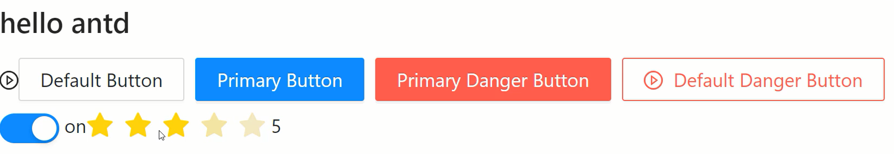
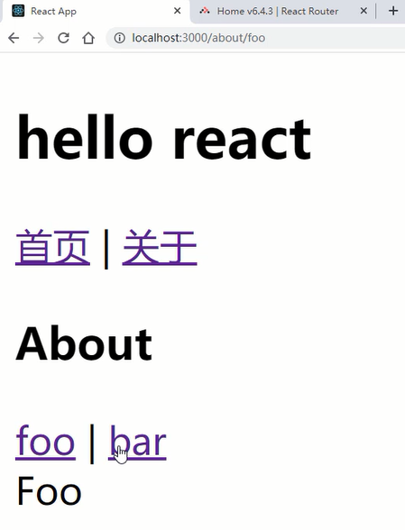
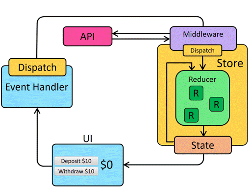

# React18核心概念与类组件使用
## props细节详解及注意事项

### 构造器中获取props数据

props是我们React父子组件之间通信的对象，那么这个对象在构造器`constructor`中是获取不到的。

```jsx
class Welcome extends React.Component {
    constructor(){
        super();
        console.log( this.props.msg )   // undefined
    }
    render(){
        return (
            <div>hello world, {this.props.msg}</div>
        );
    }
}
let element = (
    <Welcome msg="hi react" />
);
```

可以通过给`super()`传递props参数是可以做到的，代码如下：

```jsx
constructor(props){
    super(props);
    console.log( this.props.msg )   // hi react
}
```

那么React类组件是如何设计的呢？就要对面向对象非常的熟悉，原理分析如下：

```jsx
class Foo {
    constructor(props){
        this.props = props;
    }
}
class Bar extends Foo {
    constructor(props){
        super(props);
        console.log(this.props);
    }
    render(){
        console.log(this.props);
        return '';
    }
}
let props = {
    msg: 'hello world'
};
let b = new Bar(props);
b.props = props;
b.render();
```

### 多属性的传递

当有非常多的属性要传递的时候，那么会比较麻烦，所以可通过扩展运算形式进行简写。

```jsx
class Welcome extends React.Component {
    render(){
        let { msg, username, age } = this.props;
        console.log( isChecked );
        return (
            <div>hello world, {msg}, {username}, {age}</div>
        );
    }
}
let info = {
    msg: 'hi react',
    username: 'xiaoming',
    age: 20
};
let element = (
    <Welcome {...info} />
);
```

### 给属性添加默认值与类型

```jsx
import PropTypes from 'prop-types'
class Welcome extends React.Component {
    static defaultProps = {
        age: 0
    }
    static propTypes = {
        age: PropTypes.number
    }
    ...
}
```

这里的类型需要引入第三方模块才可以生效。

当父子通信的时候，如果只写属性，不写值的话，那么对应的值就是布尔值true。

## 类组件中事件的使用详解

首先React中的事件都是采用事件委托的形式，所有的事件都挂载到组件容器上，其次event对象是合成处理过的。一般情况下这些都是内部完成的，我们在使用的时候并不会有什么影响，作为了解即可。

### 事件中this的处理

在事件中最重要的就是处理this指向问题了，这里我们推荐采用面向对象中的`public class fields`语法。

```jsx
 class Welcome extends React.Component {
    handleClick = (ev) => {  //推荐 public class fields
        console.log(this);   //对象
    }
    handleClick(){   		 //不推荐 要注意修正指向
        console.log(this);   //按钮 
    }
    render(){
        return (
            <div>
                <button onClick={this.handleClick}>点击</button>
                hello world
            </div>
        );
    }
}
let element = (
    <Welcome />
);
```

### 事件传参处理

推荐采用函数的高阶方式，具体代码如下：

```jsx
class Welcome extends React.Component {
    handleClick = (num) => {   // 高阶函数
        return (ev) => {
            console.log(num);
        }
    }
    render(){
        return (
            <div>
                <button onClick={this.handleClick(123)}>点击</button>
                hello world
            </div>
        );
    }
}
let element = (
    <Welcome />
);
```
## state细节详解及React18的自动批处理

### 自动批处理

自动批处理，即有助于减少在状态更改时发生的重新渲染次数。在React18之前也有批处理的，但是在Promise、setTimeout、原生事件中是不起作用的。

实际上自动批处理指的是，同一时机多次调用`setState()`方法的一种处理机制。

```jsx
handleClick = () => {  
    this.setState({
        msg: 'hi'
    });
    this.setState({
        count: 1
    });
}
```

这里的代码当点击触发后，虽然调用了两次`setState()`方法，但是只会触发一次`render()`方法的重新执行。那么这就是所谓的自动批处理机制，这样是有助于性能的，减少重新执行的次数。

而且不管在什么时机下，都不会有问题的，这个在React18版本之前并不是所有的情况都好用的，比如：定时器。

```jsx
handleClick = () => {  
    setTimeout(()=>{
        this.setState({
            msg: 'hi'
        });
        this.setState({
            count: 1
        });
    }, 2000)
}
```

上面代码在React18之前的版本中，将会触发两次`render()`方法。默认是自动批处理的，当然也可以改成不是自动批处理的方式，通过`ReactDOM.flushSync`这个方法。

```jsx
handleClick = () => {  
    ReactDOM.flushSync(()=>{
        this.setState({
            msg: 'hi'
        });
    })
    ReactDOM.flushSync(()=>{
        this.setState({
            count: 1
        });
    }) 
}
```

### 异步处理

既然React18对多次调用采用的是自动批处理机制，那么就说明这个`setState()`方法是异步的，所以要注意方法调用完后，我们的state数据并不会立即发生变化，因为state可能会被先执行了。

```jsx
handleClick = () => {  
    /* this.setState({
          count: this.state.count + 1
        });
        console.log( this.state.count ); */
    this.setState({
        count: this.state.count + 1
    }, ()=>{  //异步执行结束后的回调函数
        console.log( this.state.count );
    });
}
```

可利用`setState()`方法的第二个参数来保证数据更新后再去执行。这里还要注意同样的数据修改只会修改一次，可利用`setState()`的回调函数写法来保证每一次都能触发。

```jsx
handleClick = () => {  
    /* this.setState({
          count: this.state.count + 1
        });
        this.setState({
          count: this.state.count + 1
        });
        this.setState({
          count: this.state.count + 1
        }); */
    this.setState((state)=> ({count: state.count + 1}));
    this.setState((state)=> ({count: state.count + 1}));
    this.setState((state)=> ({count: state.count + 1}));
}
```

这样页面按钮点击一次，count会从0直接变成了3。

## PureComponent与shouldComponentUpdate

PureComponent与shouldComponentUpdate这两个方法都是为了减少没必要的渲染，React给开发者提供了改善渲染的优化方法。

### shouldComponentUpdate

当我们在调用`setState()`方法的时候，如果数据没有改变，实际上也会重新触发`render()`方法。

```jsx
class Welcome extends React.PureComponent {
    state = {
        msg: 'hello',
        count: 0
    }
    handleClick = () => {  
        this.setState({
            msg: 'hello'
        });
    }
    render(){
        console.log('render');
        return (
            <div>
                <button onClick={this.handleClick}>点击</button>
                {this.state.msg}, {this.state.count}
            </div>
        );
    }
}
let element = (
    <Welcome />
);
```

上面的`render()`方法还是会不断的触发，但是实际上这些render触发是没有意义的，所以可以通过`shouldComponentUpdate`钩子函数进行性能优化处理。

```jsx
class Welcome extends React.Component {
    state = {
        msg: 'hello',
        count: 0
    }
    handleClick = () => {  
        this.setState({
            msg: 'hi'
        });
    }
    shouldComponentUpdate = (nextProps, nextState) => {
        if(this.state.msg === nextState.msg){
            return false;
        }
        else{
            return true;
        }
    }
    render(){
        console.log('render');
        return (
            <div>
                <button onClick={this.handleClick}>点击</button>
                {this.state.msg}, {this.state.count}
            </div>
        );
    }
}
let element = (
    <Welcome />
);
```

shouldComponentUpdate()方法的返回值，如果返回false就不进行界面的更新，如果返回true就会进行界面的更新。这样就可以根据传递的值有没有改变来决定是否进行重新的渲染。

### PureComponent

PureComponent表示纯组件，当监控的值比较多的时候，自己去完成判断实在是太麻烦了，所以可以通过PureComponent这个内置的纯组件来自动完成选择性的渲染，即数据改变了重新渲染，数据没改变就不重新渲染。

```jsx
class Welcome extends React.PureComponent {
    state = {
        msg: 'hello',
        count: 0
    }
    handleClick = () => {  
        this.setState({
            msg: 'hi'
        });
    }
    render(){
        console.log('render');
        return (
            <div>
                <button onClick={this.handleClick}>点击</button>
                {this.state.msg}, {this.state.count}
            </div>
        );
    }
}
let element = (
    <Welcome />
);
```

改成了纯组件后，记得不要直接对数据进行修改，必须通过`setState()`来完成数据的改变，不然纯组件的特性就会失效。

```jsx
class Welcome extends React.PureComponent {
    state = {
        msg: 'hello',
        count: 0,
        list: ['a', 'b', 'c']
    }
    handleClick = () => {  
        /* this.setState({
          list: [...this.state.list, 'd']
        }); */
        //错误✖
        /* this.state.list.push('d');
        this.setState({
          list: this.state.list
        }) */
    }
    render(){
        console.log('render');
        return (
            <div>
                <button onClick={this.handleClick}>点击</button>
                <ul>
                    {
                        this.state.list.map((v, i)=> <li key={i}>{v}</li>)
                    }
                </ul>
            </div>
        );
    }
}
let element = (
    <Welcome />
);
```
## immutable.js不可变数据集合

在上一个小节中，我们对数组进行了浅拷贝处理，这样可以防止直接修改数组的引用地址。但是对于深层次的对象就不行了，需要进行深拷贝处理。

但是常见的深拷贝处理机制，对于性能或功能性上都有一定的制约性，所以不复杂的数据，我们直接就可以选择用`lodash`库中提供的深拷贝方法处理就可以了。但是对于复杂的对象就需要拷贝性能问题，这就可以用到本小节中介绍的immutable.js不可变数据集合。

### immutable.js库

Immutable 是 Facebook 开发的不可变数据集合。不可变数据一旦创建就不能被修改，使得应用开发更简单，允许使用函数式编程技术，比如惰性评估。Immutable JS 提供一个惰性 `Sequence，`允许高效的队列方法链，类似 `map` 和 `filter` ，不用创建中间代表。

具体是如何做到高效的，可以参考图示。

<div align=center>
    
    <div>immutablejs</div>
</div>

下面就来看一下immutable.js的基本使用吧，代码如下：

```jsx
import Immutable from 'immutable'

class Head extends React.PureComponent {
    render(){
        console.log('render');
        return (
            <div>head component, {this.props.item.get('text')} </div>
        );
    }
}
class Welcome extends React.PureComponent {
    state = {
        msg: 'hello',
        count: 0,
        list: Immutable.fromJS([
            { id: 1, text: 'aaa' }
        ])
    }
    handleClick = () => {  
        let list = this.state.list.setIn([0, 'text'], 'bbb');
        this.setState({
            list
        });
    }
    render(){
        return (
            <div>
                <button onClick={this.handleClick}>点击</button>
                <Head item={this.state.list.get(0)} />
            </div>
        );
    }
}
```

主要就是通过Immutable.fromJS()先把对象转成immutable对象，再通过setIn()方法来设置数据，get()方法来获取数据。

## Refs操作DOM及操作类组件

React操作原生DOM跟Vue框架是类似的，都是通过ref属性来完成的，主要使用`React.createRef()`这个方法和`callbackRef()`这个回调函数写法。

### React.createRef()

这个方法可以创建一个ref对象，然后把这个ref对象添加到对应的JSX元素的ref属性中，就可以控制原生DOM了。

```jsx
class Welcome extends React.Component {
    myRef = React.createRef()
    handleClick = () => {   
        //console.log(this.myRef.current);  // 原生DOM 
        this.myRef.current.focus();
    }
    render(){
        return (
            <div>
                <button onClick={this.handleClick}>点击</button>
                <input type="text" ref={this.myRef} />
            </div>
        );
    }
}
```

### 回调函数写法

还可以编写一个回调函数来完成，原生DOM的操作。

```jsx
class Welcome extends React.Component {
    callbackRef = (element) => {
        element.focus();
    }
    handleClick = () => {   
        this.myRef.focus();
    }
    render(){
        return (
            <div>
                <button onClick={this.handleClick}>点击</button>
                <input type="text" ref={this.callbackRef} />
            </div>
        );
    }
}
```

### Ref操作类组件

除了可以把ref属性添加到JSX元素上，还可以把ref属性添加到类组件上，那么这样可以拿到类组件的实例对象。

```jsx
class Head extends React.Component {
    username = 'xiaoming';
    render(){
        return (
            <div>head component</div>
        );
    }
}

class Welcome extends React.Component {
    myRef = React.createRef()
    handleClick = () => {   
        console.log(this.myRef.current);   //组件的实例对象
        console.log(this.myRef.current.username);
    }
    render(){
        return (
            <div>
                <button onClick={this.handleClick}>点击</button>
                <Head ref={this.myRef} />
            </div>
        );
    }
}
```

这样可以间接的实现父子组件之间的数据通信。

ref属性还可以进行转发操作，可以把ref传递到组件内，获取到子组件的DOM元素。

```jsx
class Head extends React.Component {
    render(){
        return (
            <div ref={this.props.myRef}>head component</div>
        );
    }
}
class Welcome extends React.Component {
    myRef = React.createRef()
    handleClick = () => {   
        console.log(this.myRef.current);
    }
    render(){
        return (
            <div>
                <button onClick={this.handleClick}>点击</button>
                <Head myRef={this.myRef} />
            </div>
        );
    }
}
```

## 详解常见生命周期钩子函数

在学习Vue的时候，我们就已经介绍了生命周期钩子函数的概念，React中也存在一些钩子函数。我们可以为类组件声明一些特殊的方法，当组件挂载、更新或卸载时就会去执行这些函数。

要想学习React类组件的生命周期钩子函数，可以参考生命周期图谱。地址：https://projects.wojtekmaj.pl/react-lifecycle-methods-diagram/

<div align=center>
    
    <div>常见生命周期图谱</div>
</div>

生命周期主要分为三个阶段：

- 挂载时
- 更新时
- 卸载时

挂载时对应的钩子函数有：`constructor`，`render`，`componentDidMount`。

更新时对应的钩子函数有：`render`，`componentDidUpdate`

卸载时对应的钩子函数有：`componentWillUnmount`

可以看到挂载时和更新时都有`render`这个方法。这就是为什么state改变的时候，会触发`render`重渲染操作。

```jsx
class Welcome extends React.Component {
    state = {
        msg: 'hello world'
    }
    constructor(props){
        super(props);
        console.log('constructor');
    }
    componentDidMount = () => {
        // react中发起ajax请求的初始操作，在这个钩子中完成
        console.log('componentDidMount');
    }
    componentDidUpdate = () => {
        // 等DOM更新后触发的钩子
        console.log('componentDidUpdate');
    }
    componentWillUnmount = () => {
        console.log('componentWillUnmount');
    }
    handleClick = () => {  
        /* this.setState({
          msg: 'hi react'
        }); */
        //this.forceUpdate();
        root.unmount();   // 触发卸载组件
    }
    render(){
        console.log('render');
        return (
            <div>
                <button onClick={this.handleClick}>点击</button>
                { this.state.msg }
            </div>
        );
    }
}
```
## 详解不常见生命周期钩子函数

不常见的生命周期钩子函数有以下几个：

- getDerivedStateFromProps：props派生state的值
- shouldComponentUpdate：优化render渲染次数
- getSnapshotBeforeUpdate：DOM更新前的快照

## getDerivedStateFromProps

这个钩子主要是由props来决定state的值，这个需求比较少，下面来看例子。

```jsx
class Welcome extends React.Component {
    state = {
        isAdd: false,
        lastNow: 0
    }
    static getDerivedStateFromProps = (props, state) => {
        return {
            isAdd: props.currentNow > state.lastNow,
            lastNow: props.currentNow
        }
    }
    render(){
        return (
            <div>
                { this.state.isAdd ? '累加' : '累减' }, { this.state.lastNow }
            </div>
        );
    }
}
let now = 0;
let dir = 1;
setInterval(()=>{
    if(now === 0){
        dir = 1;
    }
    else if(now === 5){
        dir = -1;
    }
    now += dir;
    let element = (
        <Welcome currentNow={now} />
    );
    root.render(element);
}, 1000)
```

 通过props的变化来决定state的值，可以完成一些界面的更新操作。

### shouldComponentUpdate

根据返回的结果的不同，选择性进行渲染，是进行性能优化的一种手段，这个钩子在前面学习PureComponent小节中就已经学习到了，这里不再赘述该如何使用。

### getSnapshotBeforeUpdate

这个钩子可以触发DOM更新前的快照，可以把更新前的一些数据通过return提供出来，并通过`componentDidUpdate`钩子的第三个参数进行接收。

可以利用这一点来进行DOM前后对比的差异比较，代码如下：

```jsx
class Welcome extends React.Component {
    state = {
        list: ['a', 'b', 'c']
    }
    myRef = React.createRef()
    handleClick = () => {
        this.setState({
            list: [...this.state.list, 'd', 'e', 'f']
        })
    }
    getSnapshotBeforeUpdate = (props, state) => {
        return this.myRef.current.offsetHeight;
    }
    componentDidUpdate = (props, state, snapshot) => {
        console.log( this.myRef.current.offsetHeight - snapshot );
    }
    render(){
        return (
            <div>
                <button onClick={this.handleClick}>点击</button>
                <ul ref={this.myRef}>
                    { this.state.list.map((v, i)=> <li key={i}>{v}</li>) }
                </ul>
            </div>
        );
    }
}
```
## 组件内容的组合模式

React组件也是可以进行内容分发的，但是并不想Vue一样通过插槽来进行接收，而是通过props.children这个属性进行接收的。

```jsx
class Welcome extends React.Component {
    render(){
        return (
            <div>
                hello world, { this.props.children }
            </div>
        );
    }
}
let element = (
    <Welcome>
        <h2>这是一个标题</h2>
    </Welcome>
);
```

那么如何进行多内容的分区域处理呢？也就是Vue中多插槽的概念。这个就不能利用props.children来实现了，只能采用React模板的能力，通过传递JSX元素的方式进行实现。

```jsx
class Welcome extends React.Component {
    render(){
        return (
            <div>
                { this.props.title }
                hello world
                { this.props.content }
            </div>
        );
    }
}
let element = (
    <Welcome title={ <h2>这是一个标题</h2> } content={ <p>这是一个段落</p> } />
);
```

## 复用组件功能之Render Props模式

### Render Props模式

术语 “render props” 是指一种在 React 组件之间使用一个值为函数的 prop 共享代码的简单技术。利用这种方式可以实现组件之间的功能复用操作。

```jsx
class MouseXY extends React.Component {
    state = {
        x: 0,
        y: 0
    }
    componentDidMount = () => {
        document.addEventListener('mousemove', this.move)
    }
    componentWillUnmount = () => {
        document.removeEventListener('mousemove', this.move)
    }
    move = (ev) => {
        this.setState({
            x: ev.pageX,
            y: ev.pageY
        });
    }
    render(){
        return (
            <React.Fragment>
                { this.props.render(this.state.x, this.state.y) }
            </React.Fragment>
        );
    }
}
class Welcome extends React.Component {
    render(){
        return (
            <MouseXY render={(x, y)=> 
               <div>
                  hello world, {x}, {y}
               </div>
            } />
        );
    }
}
let element = (
    <Welcome />
);
```

主要就是render属性后面的值是一个回调函数，通过这个函数的形参可以得到组件中的数据，从而实现功能的复用。

## 复用组件功能之HOC高阶组件模式

### HOC高阶组件

除了Render Props模式可以复用组件外，还可以利用HOC高阶组件来实现，他是React 中用于复用组件逻辑的一种高级技巧，具体而言，就是参数为组件，返回值为新组件的函数。

```jsx
function withMouseXY(WithComponent){
    return class extends React.Component {
        state = {
            x: 0,
            y: 0
        }
        componentDidMount = () => {
            document.addEventListener('mousemove', this.move)
        }
        componentWillUnmount = () => {
            document.removeEventListener('mousemove', this.move)
        }
        move = (ev) => {
            this.setState({
                x: ev.pageX,
                y: ev.pageY 
            })
        }
        render(){
            return <WithComponent {...this.state} />
        }
    }
}
class Welcome extends React.Component {
    render(){
        return (
            <div>
                hello world, { this.props.x }, { this.props.y }
            </div>
        );
    }
}
const MouseWelcome = withMouseXY(Welcome)
let element = (
    <MouseWelcome />
);
```

## 组件跨层级通信方案Context

### Context通信

前面我们学习了父子组件之间的通信，有时候我们需要多层组件之间的嵌套，那么如果从最外层一层一层的把数据传递到最内层的话势必会非常的麻烦。

所以context的作用就是解决这个问题，可以把数据直接从最外层传递给最内层的组件。

```jsx
let MyContext = React.createContext();
class Welcome extends React.Component {
    state = {
        msg: 'welcome组件的数据'
    }
    render(){
        return (
            <div>
                Hello Welcome
                <MyContext.Provider value={this.state.msg}>
                    <Head />
                </MyContext.Provider>
            </div>
        );
    }
}
class Head extends React.Component {
    render(){
        return (
            <div>
                Hello Head
                <Title />
            </div>
        );
    }
}
class Title extends React.Component {
    static contextType = MyContext
    componentDidMount = () => {
        console.log( this.context );
    }
    render(){
        return (
            <div>
                Hello Title <MyContext.Consumer>{ value => value }</MyContext.Consumer>
            </div>
        );
    }
}
let element = (
    <Welcome />
);
```

这里传递的语法，是通过`<MyContext.Provider>`组件携带`value`属性进行向下传递的，那么接收的语法是通过`<MyContext.Consumer>`组件。

也可以定义一个静态方法`static contextType = MyContext`，这样就可以在逻辑中通过`this.context`来拿到同样的值。

# React18之Hook与函数组件 – 优雅简易的开发模式 

## 函数组件基本使用及点标记组件写法

### 函数组件的基本使用

函数组件是比类组件编写起来更简单的一种组件形式，对比如下：

```jsx
// 类组件
class Welcome extends React.Component {
    render(){
        return (
            <div>hello world</div>
        );
    }
}
// 函数组件
let Welcome = () => {
    return (
        <div>hello world</div>
    );
}
```

基本对比外，还可以在函数组件中完成，父子通信，事件，默认值等操作，代码如下：

```jsx
let Welcome = (props) => {
    const handleClick = () => {
        console.log(123);
    }
    return (
        <div>
            <button onClick={handleClick}>点击</button>
            <div>hello world, { props.count }</div>
        </div>
    );
}
Welcome.defaultProps = {
    count: 0
}
Welcome.propTypes = {
    count: PropTypes.number
}
```

### 点标记组件写法

无论是函数组件还是类组件，都可以进行点标记的写法操作组件。

```jsx
const Imooc = {
    Welcome: class extends React.Component {
        render(){
            return (
                <div>hello Welcome</div>
            )
        }
    },
    Head: () => {
        return (
            <div>hello Head</div>
        )
    }
}
let element = (
    <div>
        <Imooc.Welcome />
        <Imooc.Head />
    </div>
);
```

这种写法，适合复杂组件的形式，可扩展子组件进行组合使用，更加具备语义化操作。

## Hook概念及Hook之useState函数

### 什么是Hook

Hook 是 React 16.8 的新增特性。它可以让你在不编写 class 的情况下使用 state 以及其他的 React 特性。

Hook 是一个特殊的函数，它可以让你“钩入” React 的特性。例如，useState 是允许你在 React 函数组件中添加 state 的 Hook。

下面就可以学习我们Hook中的第一个钩子函数，即：useState函数。这个钩子函数主要实现的功能就是类似于类组件中setState()方法所实现的功能，当数据发生改变的时候可以重新执行组件的重渲染操作。

```jsx
let { useState } = React;
let Welcome = (props) => {
    const [count, setCount] = useState(0);
    const handleClick = () => {
        setCount(count + 1)       
    }
    return (
        <div>
            <button onClick={handleClick}>点击</button>
            <div>hello world, { count }</div>
        </div>
    );
}
```

当点击按钮的时候，通过调用`setCount`来修改count值，从而使得Welcome组件重新执行，而useState函数具备记忆功能，所以再次得到的count值就是修改之后的值，那么视图重新渲染就会显示新的效果。

在使用Hook钩子函数的时候，要一些规范要求，那么就是只能在最顶层使用Hook，只能在函数组件中使用Hook。也就是useState一定要放到组件的最前面进行调用，不要在函数或语句中进行调用。

那么setCount函数是用来修改count数据的，所以他跟前面讲的类组件的state是很像的，也是具备自动批处理能力的，如果不想使用这种自动批处理能力的话，还是可以使用`flushSync`这个方法。

```jsx
let { useState } = React;
let { flushSync } = ReactDOM;
let Welcome = (props) => {
    const [count, setCount] = useState(0);
    const [msg, setMsg] = useState('hello');
    const handleClick = () => {
        flushSync(()=>{
          setCount(count + 1)
        })
        flushSync(()=>{
          setMsg('hi')
        })       
    }
    return (
        <div>
            <button onClick={handleClick}>点击</button>
            <div>hello world, { count }, { msg }</div>
        </div>
    );
}
```

以上对Welcome组件重新渲染了两次。setCount函数具备回调函数的写法，可以把相同的操作进行都触发的行为。

```jsx
setCount((count)=> count+1)
setCount((count)=> count+1)
setCount((count)=> count+1)

<div>{ count }</div>   // 渲染 3
```

useState中的值在修改的时候，并不会进行原值的合并处理，所以使用的时候要注意。可利用扩展运算符的形式来解决合并的问题。

```jsx
const [info, setInfo] = useState({
    username: 'xiaoming',
    age: 20
})
setInfo({
    ...info,
    username: 'xiaoqiang'
})
```

如果遇到初始值需要大量运算才能获取的话，可采用惰性初始state，useState()添加回调函数的形式来实现。

```jsx
const initCount = () => {
    console.log('initCount');
    return 2*2*2;
}
const [count, setCount] = useState(()=>{
    return initCount();
});
```

这样初始只会计算一次，并不会每次都重新进行计算。

## 详解Hook之useEffect函数

### 什么是useEffect Hook

Effect Hook 可以让你在函数组件中执行副作用操作，副作用即：DOM操作、获取数据、记录日志等，uEffect Hook 可以用来代替类组件中的生命周期钩子函数。

首先来看一下useEffect钩子的基本使用，代码如下：

```jsx
let { useState, useEffect } = React;
let Welcome = (props) => {
    const [count, setCount] = useState(0);
    useEffect(()=>{
        // 初始 和 更新 数据的时候会触发回调函数
        console.log('didMount or didUpdate');
    })
    const handleClick = () => {
        setCount(count + 1);
    }
    return (
        <div>
            <button onClick={handleClick}>点击</button>
            <div>hello world, { count }</div>
        </div>
    );
}
```

当有一些副作用需要进行清理操作的时候，在useEffect中可通过return返回回调函数来实现。

```jsx
let Welcome = (props) => {
    const [count, setCount] = useState(0);
    //异步函数，在浏览器渲染DOM后触发的
    useEffect(()=>{
        console.log('didMount or didUpdate');
        return ()=>{  // 这里回调函数可以用来清理副作用
            console.log('beforeUpdate or willUnmount');
        }
    })
    const handleClick = () => {
        //setCount(count + 1);
        root.unmount();
    }
    return (
        <div>
            <button onClick={handleClick}>点击</button>
            <div>hello world, { count }</div>
        </div>
    );
}
```

在更新前触发或在卸载时候触发`beforeUpdate or willUnmount`，这样可以对某些副作用进行清理操作。

useEffect有很多需要注意的事项，总结如下：

- 使用多个 Effect 实现关注点分离
- 通过跳过 Effect 进行性能优化
- Effect 中使用了某个响应式数据，一定要进行数组的依赖处理
- 频繁的修改某个响应式数据，可通过回调函数进行改写
- useEffect()是在渲染被绘制到屏幕之后执行的，是异步的；useLayoutEffect()是在渲染之后但在屏幕更新之前，是同步的

### 使用多个 Effect 实现关注点分离

因为useEffect可以调用多次，每一次都是独立的，互相不影响，所以可以进行逻辑关注点的分离操作。

```jsx
let Welcome = (props) => {
    const [count, setCount] = useState(0);
    useEffect(()=>{
        console.log(count);
    })
    const [msg, setMsg] = useState('hello');
    useEffect(()=>{
        console.log(msg);
    })
    const handleClick = () => {
        setCount(count + 1);
    }
    return (
        <div>
            <button onClick={handleClick}>点击</button>
            <div>hello world, { count }, { msg }</div>
        </div>
    );
}
```

### 通过跳过 Effect 进行性能优化

当关注点分离后，改变一个数据后，例如count，那么msg相关的useEffect也会触发，那么对于性能这块还是有一些影响的，能不能做到哪一个数据改变了，只重新触发自己的useEffect回调函数呢？

可以通过给useEffect设置第二个参数来做到。

```jsx
const [count, setCount] = useState(0);
useEffect(()=>{
    console.log(count);
}, [count])
const [msg, setMsg] = useState('hello');
useEffect(()=>{
    console.log(msg);
}, [msg])
```

### Effect 中使用了某个响应式数据，一定要进行数组的依赖处理

```jsx
let Welcome = (props) => {
    const [count, setCount] = useState(0);
    useEffect(()=>{
        console.log(count);
    }, [])   // ✖ 当useEffect中有响应式数据，那么在依赖数组中一定要指定这个响应式数据

    useEffect(()=>{
        console.log(123);
    }, [])   // ✔ 只有初始化的时候触发，模拟 初始的生命周期钩子 

    const handleClick = () => {
        setCount(count + 1);
    }
    return (
        <div>
            <button onClick={handleClick}>点击</button>
            <div>hello world, { count }</div>
        </div>
    );
}
```

当useEffect中使用了响应式的数据count时候，需要在[]中进行依赖处理，`[count]`这样才是符合规范的。

### 频繁的修改某个响应式数据，可通过回调函数进行改写

```jsx
let Welcome = (props) => {
    const [count, setCount] = useState(0);
    useEffect(()=>{
        setInterval(()=>{
            setCount(count + 1);
        }, 1000)
    }, [count])   // ✔ 会造成定时器的累加，所以需要清理，非常麻烦的

    useEffect(()=>{
        setInterval(()=>{
            setCount((count)=> count + 1);
        }, 1000)
    }, [])   // ✔

    const handleClick = () => {
        setCount(count + 1);
    }
    return (
        <div>
            <button onClick={handleClick}>点击</button>
            <div>hello world, { count }</div>
        </div>
    );
}
```

第一种写法，会频繁的触发useEffect重新执行，那么就需要不断的清除定时，非常的不方便，所以可以写成像第二种写法那样，通过回调函数去修改count数据，这样就不会对定时器进行累加，也不会影响到useEffect的规范使用。

### useEffect异步与useLayoutEffect同步

在React中提供了一个跟useEffect类似的钩子，useLayoutEffect这个钩子。

useEffect()是在渲染被绘制到屏幕之后执行的，是异步的；useLayoutEffect()是在渲染之后但在屏幕更新之前，是同步的。

具体看下面这个例子：

```jsx
let { useState, useEffect, useLayoutEffect } = React;
let Welcome = (props) => {
    const [msg, setMsg] = useState('hello world');
    useEffect(()=>{
        let i = 0;
        while(i<100000000){
            i++;
        }
        setMsg('hi react');
    })
    /* useLayoutEffect(()=>{
        let i = 0;
        while(i<100000000){
          i++;
        }
        setMsg('hi react');
      }) */
    return (
        <div>
            <div>{ msg }</div>
        </div>
    );
}
```

使用useEffect，页面会看到闪烁的变化，而采用useLayoutEffect就不会看到数据闪烁的问题，因为useLayoutEffect可以同步显示UI，大部分情况下我们采用useEffect()，性能更好。但当你的useEffect里面的操作需要处理DOM，并且会改变页面的样式，就需要用useLayoutEffect，否则可能会出现闪屏问题。

## 详解Hook之useRef函数

useRef函数的作用就是原生DOM操作，跟类组件中的ref操作是类似的，也是可以通过回调函数和useRef()两种方式来操作原生DOM。

### 回调函数形式

```jsx
let Welcome = (props) => {  
    const handleClick = () => {
    }
    const elementFn = (elem) => {
        console.log(elem);
    }
    return (
        <div>
            <button onClick={handleClick}>点击</button>
            <input ref={elementFn} type="text" />
        </div>
    );
}
```

### useRef()形式

```jsx
let { useRef } = React;
let Welcome = (props) => {  
    const myRef = useRef()
    const handleClick = () => {
        myRef.current.focus()
    }
    return (
        <div>
            <button onClick={handleClick}>点击</button>
            <input ref={myRef} type="text" />
        </div>
    );
}
```

### 函数转发

可以把ref添加到函数组件上，那么就可以把ref对应的对象转发到子组件的内部元素身上。

```jsx
let Head = React.forwardRef((props, ref) => {
    return (
        <div>
            hello Head
            <input type="text" ref={ref} />
        </div>
    )
})
let Welcome = (props) => {  
    const myRef = useRef()
    const handleClick = () => {
        myRef.current.focus();
    }
    return (
        <div>
            <button onClick={handleClick}>点击</button>
            <Head ref={myRef} />
        </div>
    );
}
```

### useRef的记忆能力

useRef可以做到跟useState类似的功能，就是可以对值进行记忆操作。

```jsx
let Welcome = (props) => {  
    const [num, setNum] = useState(0);
    //let count = 0;  //不具备记忆功能的
    let count = useRef(0);  // 可以给普通值进行记忆操作
    const handleClick = () => {
        count.current++;
        console.log(count.current);
        setNum(num + 1)
        //console.log(num);
    }
    return (
        <div>
            <button onClick={handleClick}>点击</button>

        </div>
    );
}
```

我们就可以利用这一点，来实现一些应用，例如利用useRef来对useEffect进行只做更新的操作。

```jsx
let Welcome = (props) => {  
    const [num, setNum] = useState(0);
    let isUpdate = useRef(false);
    useEffect(()=>{
        if(isUpdate.current){
            console.log(123);
        }
    })
    const handleClick = () => {
        setNum(num + 1)
        isUpdate.current = true;
    }
    return (
        <div>
            <button onClick={handleClick}>点击</button>
        </div>
    );
}
```

## 详解Hook之useContext函数

### useContext函数

这个函数用来创建context对象，而context对象的用法跟类组件中的context对象是一样的，也是完成跨组件通信的。

涉及到的语法有：

- let MyContext = React.createContext()
- <MyContext.Provider value={}>
- let value = useContext(MyContext)

let MyContext = React.createContext()用于得到一个可以进行传递数据的组件，<MyContext.Provider value={}>用于实现数据的传递。let value = useContext(MyContext)用于获取传递进组件内的值。

```jsx
let { useContext } = React;
let MyContext = React.createContext('默认值');
let Welcome = (props) => {  
    return (
        <div>
            hello Welcome
            <MyContext.Provider value="welcome的问候~~~">
                <Head />
            </MyContext.Provider>
        </div>
    );
}
let Head = () => {
    return (
        <div>
            hello Head
            <Title />
        </div>
    );
}
let Title = () => {
    let value = useContext(MyContext);
    return (
        <div>
            hello Title, { value }
        </div>
    );
}
```

## 函数组件性能优化之React.memo

在本小节中将对函数组件的性能进行一个简单的了解，首先函数组件中的数据没有发生改变的时候，是不会重新渲染视图的。

```jsx
let Welcome = (props) => {  
    const [ count, setCount ] = useState(0);
    const handleClick= () => {
        setCount(0);
    }
    console.log(123);
    return (
        <div>
            <button onClick={handleClick}>点击</button>
            hello Welcome { Math.random() }
        </div>
    );
}
```

在上面的程序中，当点击了按钮，123是不会被打印的。这里我们还需要了解一种特殊的现象，代码如下：

```jsx
let Welcome = (props) => {  
    const [ count, setCount ] = useState(0);
    const handleClick= () => {
        setCount(1);
    }
    console.log(123);
    return (
        <div>
            <button onClick={handleClick}>点击</button>
            hello Welcome { Math.random() }
        </div>
    );
}
```

上面的代码，当点击按钮后，应该触发一次123后就不会再触发了，但是实际上确触发了两次，那么这是为什么呢？实际上React官网上有对这一现象做过说明。

链接地址如下：https://zh-hans.reactjs.org/docs/hooks-reference.html#bailing-out-of-a-state-update。引用内容如下：

如果你更新 State Hook 后的 state 与当前的 state 相同时，React 将跳过子组件的渲染并且不会触发 effect 的执行。（React 使用 [`Object.is` 比较算法](https://developer.mozilla.org/en-US/docs/Web/JavaScript/Reference/Global_Objects/Object/is#Description) 来比较 state。）

需要注意的是，React 可能仍需要在跳过渲染前渲染该组件。不过由于 React 不会对组件树的“深层”节点进行不必要的渲染，所以大可不必担心。如果你在渲染期间执行了高开销的计算，则可以使用 `useMemo` 来进行优化。

内部只是为了进行检测，并不会影响我们的效果。这里还说到了如果不想让组件在没有数据依赖的情况下，可通过`React.memo`来避免没有必要的重新渲染，实际上`React.memo`的功能类似于类组件中的纯函数概念。

```jsx
let Welcome = (props) => {  
    const [ count, setCount ] = useState(0);
    const handleClick= () => {
        setCount(1);
    }
    return (
        <div>
            <button onClick={handleClick}>点击</button>
            hello Welcome
            <Head count={count} />
        </div>
    );
}
let Head = React.memo(() => {
    return (
        <div>hello Head, { Math.random() }</div>
    )
})
```

当count没有发生改变的时候，那么<Head>组件不会重新触发。


## 详解Hook之useCallback与useMemo函数

useCallback返回一个可记忆的函数，useMemo返回一个可记忆的值，useCallback只是useMemo的一种特殊形式。

那么这到底是什么意思呢？实际上我们在父子通信的时候，有可能传递的值是一样的，但是传递的内存地址可能是不一样的，那么在React眼里是会对组件进行重新执行的。

一般对象类型的值都是具备内存地址的，所以值相同，但内存地址可能不同，举例如下：

```jsx
let Welcome = (props) => {  
    const [ count, setCount ] = useState(0);
    const handleClick= () => {
        setCount(count+1);
    }
    const foo = () => {}
    return (
        <div>
            <button onClick={handleClick}>点击</button>
            hello Welcome
            <Head bar={bar} />
        </div>
    );
}
```

当点击按钮的时候，<Head>组件会进行重新渲染，因为每次重新触发<Welcome>组件的时候，后会重新生成一个新的内存地址的foo函数。

那么如何不让foo函数重新生成，使用之前的函数地址呢？因为这样做可以减少子组件的渲染，从而提升性能。可以通过useCallback来实现。

```jsx
const foo = useCallback(() => {}, [])
```

而有时候这种需要不一定都是函数，比如数组的情况下，我们就需要用到useMemo这个钩子函数了，useMemo更加强大，其实useCallback是useMemo的一种特殊形式而已。

```jsx
const foo = useMemo(()=> ()=>{}, [])   // 针对函数
const bar = useMemo(()=> [1,2,3], [])  // 针对数组
```

这里我们还要注意，第二个参数是一个数组，这个数组可以作为依赖项存在，也就是说当依赖项发生值的改变的时候，那么对应的对象就会重新创建。

```jsx
const foo = useMemo(()=> ()=>{}, [count])   // 当count改变时，函数重新创建
```

## 详解Hook之useReducer函数

useState 的替代方案。它接收一个形如 (state, action) => newState 的 reducer，并返回当前的 state 以及与其配套的 dispatch 方法。

在某些场景下，useReducer 会比 useState 更适用，例如 state 逻辑较复杂且包含多个子值，或者下一个 state 依赖于之前的 state 等。

下面是没有使用useReducer实现的一个小的案例，代码如下：

```jsx
let Welcome = (props) => {  
    const [ isLogin, setLogin ] = useState(true)
    const [ isLogout, setLogout ] = useState(false)
    const handleLogin = () => {
        setLogin(true)
        setLogout(false)
    }
    const handleLogout = () => {
        setLogin(false)
        setLogout(true)
    }
    return (
        <div>
            { isLogin ? <button onClick={handleLogout}>退出</button> : <button onClick={handleLogin}>登录</button> }
        </div>
    );
}
```

这里分成了两个useState函数去完成的，并没有体现整体关联性与统一性。下面是利用useRducer函数的改进写法。

```jsx
let { useReducer } = React;
let loginState = {
    isLogin: true,
    isLogout: false
}
let loginReducer = (state, action) => {
    switch(action.type){
        case 'login':
            return { isLogin: true, isLogout: false }
        case 'logout':
            return { isLogin: false, isLogout: true }
        default: 
            throw new Error() 
    }
}
let Welcome = (props) => {  
    const [ state, loginDispatch ] = useReducer(loginReducer, loginState);
    const handleLogin = () => {
        loginDispatch({ type: 'login' });
    }
    const handleLogout = () => {
        loginDispatch({ type: 'logout' });
    }
    return (
        <div>
            { state.isLogin ? <button onClick={handleLogout}>退出</button> : <button onClick={handleLogin}>登录</button> }
        </div>
    );
}
```

## React18之并发模式与startTransition

React 18 之前，渲染是一个单一的、不间断的、同步的事务，一旦渲染开始，就不能被中断。

React 18 引入并发模式，它允许你将标记更新作为一个 transitions，这会告诉 React 它们可以被中断执行。这样可以把紧急的任务先更新，不紧急的任务后更新。

利用startTransition这个方法来实现不紧急的任务操作。

```jsx
let { memo, useState, startTransition } = React;
let List = memo(({query})=>{
    const text = 'hello world'
    const items = []

    if( query !== '' && text.includes(query) ){
        const arr = text.split(query);
        for(let i=0;i<10000;i++){
            items.push(<li key={i}>{arr[0]}<span style={{color:'red'}}>{query}</span>{arr[1]}</li>)
        }
    }
    else{
        for(let i=0;i<10000;i++){
            items.push(<li key={i}>{text}</li>);
        }
    }

    return (
        <ul>
            { items }
        </ul>
    )
})
let Welcome = memo(()=>{
    const [ searchWord, setSearchWord ] = useState('');
    const [ query, setQuery ] = useState('');
    const handleChange = (ev) => {
        setSearchWord(ev.target.value)  //第一个任务
        startTransition(()=>{
            setQuery(ev.target.value)   //第二个任务(不紧急的任务)
        })
    }
    return (
        <div>
            <input type="text" value={searchWord} onChange={handleChange} />
            <List query={query} />
        </div>
    )
})
```

这里的`第一个任务`是紧急的，需要先执行，而`第二个任务`耗时比较长，所以可以作为不紧急任务存在，这样就不会阻塞`第一个任务`先去执行操作，从而达到不影响视图的渲染。


## React18之useTransition与useDeferredValue

在上一个小节中，我们学习了startTransiton这个方法，在本小节中讲学习两个辅助操作的方法，可以方便使用sartTransiton。

### useTransition

useTransition返回一个状态值表示过渡任务的等待状态，以及一个启动该过渡任务的函数。

```jsx
let { memo, useState, useTransition } = React;
let List = memo(({query})=>{
    const text = 'hello world'
    const items = []

    if( query !== '' && text.includes(query) ){
        const arr = text.split(query);
        for(let i=0;i<10000;i++){
            items.push(<li key={i}>{arr[0]}<span style={{color:'red'}}>{query}</span>{arr[1]}</li>)
        }
    }
    else{
        for(let i=0;i<10000;i++){
            items.push(<li key={i}>{text}</li>);
        }
    }

    return (
        <ul>
            { items }
        </ul>
    )
})
let Welcome = memo(()=>{
    const [ searchWord, setSearchWord ] = useState('');
    const [ query, setQuery ] = useState('');
    const [ pending, startTransition ] = useTransition();
    const handleChange = (ev) => {
        setSearchWord(ev.target.value)  //第一个任务
        startTransition(()=>{
            setQuery(ev.target.value)   //第二个任务(不紧急的任务)
        })
    }
    return (
        <div>
            <input type="text" value={searchWord} onChange={handleChange} />
            { pending ? <div>loading...</div> : <List query={query} /> }
        </div>
    )
})
```

利用useTransition方法得到两个值，分别是：pending 和 startTransiton。pending是一个等价的状态。当没有成功前pending得到true，当操作完成后，pending就会变成false，这样就会有更好的用户体验效果。

### useDeferredValue

useDeferredValue 接受一个值，并返回该值的新副本，该副本将推迟到更紧急地更新之后。

```jsx
let { memo, useState, useDeferredValue } = React;
let List = memo(({query})=>{
    const text = 'hello world'
    const items = []
    if( query !== '' && text.includes(query) ){
        const arr = text.split(query);
        for(let i=0;i<10000;i++){
            items.push(<li key={i}>{arr[0]}<span style={{color:'red'}}>{query}</span>{arr[1]}</li>)
        }
    }
    else{
        for(let i=0;i<10000;i++){
            items.push(<li key={i}>{text}</li>);
        }
    }
    return (
        <ul>
            { items }
        </ul>
    )
})
let Welcome = memo(()=>{
    const [ searchWord, setSearchWord ] = useState('');
    const query = useDeferredValue(searchWord); // query就是不紧急时候的值(延迟后的值)
    const handleChange = (ev) => {
        setSearchWord(ev.target.value)  //第一个任务
    }
    return (
        <div>
            <input type="text" value={searchWord} onChange={handleChange} />
            <List query={query} />
        </div>
    )
})
```

useDeferredValue()可以直接得到不紧急的值query，所以简化了操作，内部自动进行了startTransiton调用。

## 函数组件功能复用之自定义Hook

在前面讲类组件的时候，介绍了两种进行组件功能复用的操作：1. Render Props  2. HOC。

在本小节中讲介绍如何使用函数组件的自定义Hook来完成组件功能的复用操作。

还是完成页面获取鼠标坐标的小案例，代码如下：

```jsx
let { useState, useEffect } = React
let useMouseXY = () => {
    const [x, setX] = useState(0)
    const [y, setY] = useState(0)
    useEffect(()=>{
        function move(ev){
            setX(ev.pageX)
            setY(ev.pageY)
        }
        document.addEventListener('mousemove', move)
        return () => {
            document.removeEventListener('mousemove', move)
        }
    }, [])
    return {
        x,
        y
    }
}
let Welcome = ()=>{
    const {x, y} = useMouseXY()
    return (
        <div>
            hello Welcome, {x}, {y}
        </div>
    )
}
```

自定义Hook函数跟React自带的Hook函数用法类似，其实现原理也是类似的。

# React18扩展内容与脚手架使用 – 全面掌握React18特性 
## 脚手架安装及vsCode插件安装

### 脚手架的安装

React的脚手架我们采用官方提供的Create React App进行搭建，Create React App是一个用于学习 React 的舒适环境，也是用 React 创建新的单页应用的最佳方式。

它会配置你的开发环境，以便使你能够使用最新的 JavaScript 特性，提供良好的开发体验，并为生产环境优化你的应用程序。你需要在你的机器上安装Node >= 14.0.0 和 npm >= 5.6。

```shell
# 安装命令
npx create-react-app my-app
cd my-app
npm start
```

目录结构如下：

<div align=center>
    
    <div>Create React App目录结构</div>
</div>


主要开发代码在src目录下。

<div align=center>
    
    <div>src开发环境下的文件</div>
</div>


App.js为根组件，index.js为入口模块，index.css为全局样式文件。

### 插件的安装

首先需要在vsCode下安装，`ES7+ React/Redux/React-Native snippets`这个插件，他可以帮我们快速创建React组件的初始代码，也可以给JSX做一些提示操作。直接在vsCode的扩展中进行搜索即可安装。

可通过`rcc`快速创建一个类组件，可通过`rfc`快速创建一个函数组件。

除了vsCode插件外，还需要安装一个Chrome插件，React Developer Tools 这个工具，可以对React组件进行查看，并且可观察到组件传递数据的情况。

课件中已经提供了相关工具，直接在Chrome下进行安装即可。

<div align=center>
    
    <div>React Developer Tools</div>
</div>

### 脚手架下需要注意的点

- 注意点：<></>
- 注意点：import React from 'react'
- 注意点：<React.StrictMode>
- 注意点：脚手架下的注释
- 注意点：package.json中的eslint

<></>是<React.Fragment>的简写，在脚手架下可以采用这种简写方式，提供一个唯一根节点非常的有用。

import React from 'react' 这句话在React17之前是不能省略的，但是在React17版本之后是可以省略的，因为React17版本之后对JSX语法的解析有了新的转换方式，具体可参考：https://zh-hans.reactjs.org/blog/2020/09/22/introducing-the-new-jsx-transform.html

<React.StrictMode>为严格模式，可以检测到一些比较过时的语法，还有一些在操作React的时候的一些不规范写法等。

在脚手架下添加注释，可通过快捷键进行操作，通过`alt + shift + a`键来完成，非常的方便。

package.json中默认对eslint进行了支持，可找到`eslintConfig`属性进行一些eslint的设置，例如：`rules`字段。

## 脚手架下样式处理方式及Sass支持

在脚手架下对样式的处理方式非常的多，主要有：全局样式，Sass/Less支持，模块化CSS，CSS-in-JS，样式模块classnames等，下面就分别来看一下。

### 全局样式

在对应的jsx文件下创建的.css文件就是一个全局样式，在jsx引入后就可以在全局环境下生效。

```jsx
import './Welcome.css'
export default function Welcome() {
  return (
    <div className='Welcome'>
      <div className='box'>Welcome</div>
      <div className='box2'>Welcome</div>
    </div>
  )
}
```

这样操作很容易产生冲突，所以可以采用命名空间的方式来避免冲突，即最外层元素添加跟当前组件一样名字的选择器。

内部的其他选择器都是这个最外层选择器的后代选择器。

```css
// Welcome.css
.Welcome .box{
  color: yellow;
}
.Welcome .box2{
  width: 100px;
  height: 100px;
  background: blue;
}
```

不过这样写样式会很麻烦，可利用预编译CSS的嵌套写法来对代码进行改进，这里以Sass作为演示。

### 预编译CSS的支持

首先默认脚手架是不支持Sass或其他预编译CSS的，所以需要安装第三方模块来进行生效。

```shell
npm install sass
```

安装好后，就可以编写已.scss为后缀的文件了。

```scss
.Welcome{
  .box{
    width: 100px;
    height: 100px;
    background: red;
  }
  .box2{
    width: 100px;
    height: 100px;
    background: blue;
  }
}
```

### 模块化CSS

模块化的CSS，主要就是实现局部样式的能力，这样就只能在当前组件内生效，不会影响到其他的组件。模块化的CSS有格式上的要求，即`[name].module.css`

下面以Welcome组件举例：

```jsx
import style from './Welcome.module.css'
export default function Welcome() {
  return (
    <div>
      <div className={style.box}>Welcome</div>
      <div className={style.box2}>Welcome</div>
    </div>
  )
} 
```

这种局部的操作，style.box只会给指定的元素添加样式。

### CSS-in-JS

这种方法主要会把CSS代码直接写入到JSX文件内，这样可以不分成两个文件，而是只需要一个文件就可以完成一个独立的组件开发。

这种CSS-in-JS的实现是需要借助于第三方模块的，目前比较流行的是：`styled-components`这个模块。首先是需要下载。

```shell
npm install styled-components
```

```jsx
import styled from 'styled-components'
const Title = styled.h1`
  font-size: 1.5em;
  text-align: center;
  color: blue;
  background: red;
`;
const Text = styled.a`
  color: blue;
  background: red;
  &:hover {
    color: yellow;
  };
`;
export default function Welcome() {
    return (
        <div>
            <Title>我是一个标题</Title>
            <Text href="http://www.imooc.com">我是一个链接</Text>
        </div>
    )
}
```

### 样式模块classnames

有时候操作class样式的时候，往往普通的字符串很难满足我们的需求，所以可以借助第三方模块`classnames`，他允许我们操作多样式的时候可以以对象的形式进行控制。

```jsx
import './Welcome.css'
import classnames from 'classnames'
export default function Welcome() {
  //const myClass = 'box box2'
  const myClass = classnames({
    box: true,
    box2: true
  })
  return (
    <div className='Welcome'>
      <h2 className={myClass}>这是一个标题</h2>
    </div>
  )
}
```

## Ant Design框架的安装与使用（一）

### 什么是Ant Design框架

Ant Design是React的第三方UI组件库，类似于前面我们学习的Vue中的Element Plus。Ant Design是阿里巴巴旗下蚂蚁金服推出的开源框架，分为PC端与移动端。

PC端：https://ant.design

移动端：https://mobile.ant.design

下面演示PC端的使用方式，需要先下载安装，本小节安装的是"antd": "^4.24.0"这个版本，如果后续升级了，大家可以通过@方式安装当前小节中指定的版本。

```shell
npm install antd@4.24.0
```

除了在主入口文件中引入antd框架外，还需要引入他提供的antd全局样式文件。

```js
// index.css
@import '~antd/dist/antd.css'
```

在antd中如果要使用图标的话，需要单独下载并使用。

```shell
npm install @ant-design/icons
```

antd中基本组件的使用方式如下，例如：Button按钮组件，Space间距组件，Switch开关组件，Rate评分组件等：

```jsx
import { Button, Space, Switch, Rate } from 'antd'
import { PlayCircleOutlined } from '@ant-design/icons'
import { useState } from 'react'
export default function App() {
    const [ checked, setChecked ] = useState(true)
    const [ value, setValue ] = useState(3)
    return (
        <div>
            <h2>hello antd</h2>
            <PlayCircleOutlined />
            <Space>
                <Button>Default Button</Button>
                <Button type="primary">Primary Button</Button>
                <Button type="primary" danger>Primary Danger Button</Button>
                <Button danger icon={<PlayCircleOutlined />}>Default Danger Button</Button>
            </Space>
            <div>
                <Switch checked={checked} onChange={setChecked} /> { checked ? 'on' : 'off' }
                <Rate value={value} onChange={setValue} /> { value }
            </div>
        </div>
    )
}
```

<div align=center>
    
    <div>antd基本组件</div>
</div>


## Ant Design框架的安装与使用（二）

本小节我们继续来看一下，antd中的一些复杂组件的使用。

主要就是表单组件涉及的操作是比较多的，下面就一起来看一下。

```jsx
import { Button, Checkbox, Form, Input } from 'antd';
import { useState } from 'react';
export default function App() {
    const [username, setUsername] = useState('xiaoming')
    const handleFinish = (values) => {
        console.log(values)
    }
    const handleValuesChange = (values) => {
        setUsername(values.username)
    }
    return (
        <div>
            <h2>hello antd</h2>
            <Form
                className="login"
                labelCol={{
                    span: 8,
                }}
                wrapperCol={{
                    span: 16,
                }}
                onFinish={handleFinish}
                onValuesChange={handleValuesChange}
                initialValues={{username}}
                >
                <Form.Item 
                    label="用户名" 
                    name="username"
                    rules={[
                        {
                            required: true,
                            message: '用户名不能为空!',
                        },
                    ]}
                    >
                    <Input /> 
                </Form.Item>
                <Form.Item
                    wrapperCol={{
                        offset: 8,
                            span: 16,
                    }}>
                    <Checkbox />
                </Form.Item>
                <Form.Item
                    wrapperCol={{
                        offset: 8,
                            span: 16,
                    }}>
                    <Button htmlType='submit'>登录</Button>
                </Form.Item>
            </Form>
        </div>
    )
}
```

这里可以先把表单组件的结构编写完成，主要使用到<Form>和<Form.Item>这两个组件。

labelCol，wrapperCol属性主要是完成布局位置的，rules属性主要是进行表单校验的。

initialValues属性来添加初始值的，onFinish属性用于按钮触发提交后的事件函数。

### 逻辑组件

在antd中，还提供了很多逻辑组件，就是可以在JS中进行调用的组件，例如：弹出提示，通知框等。

```jsx
import { Button, message, notification } from 'antd';
export default function App() {
  const handleClick = () => {
    message.success('成功')
    notification.open({
      message: 'Notification Title',
      description: 'Notification description',
      placement: 'bottomRight'
    })
  }
  return (
    <div>
      <h2>hello antd</h2>
      <Button onClick={handleClick}>按钮</Button>
    </div>
  )
}
```


## 仿Ant Design的Button组件实现

前面小节我们已经对antd库有了了解，也学会了基本的使用。本小节要模拟实现一下antd中的Button组件，仿造实现的地址如下：https://ant.design/components/button-cn/。

首先在/src目录下创建一个新的目录，起名为/MyAntd，然后在这个文件夹下创建两个文件，即：/MyButton/MyButton.jsx 和 /MyButton/MyButton.scss。

接下来在/MyAntd下再创建一个index.js文件，作为所有组件的一个入口文件。

具体要实现组件的功能需求：

- 按钮类型
- 按钮尺寸
- 按钮文字
- 添加图标

```jsx
// /MyButton/MyButton.jsx

import React from 'react'
import './MyButton.scss'
import classnames from 'classnames'
import PropTypes from 'prop-types'
export default function MyButton(props) {
    const buttonClass = classnames({
        'my-button-default': true,
        [`my-button-${props.type}`]: true,
        [`my-button-${props.type}-danger`]: props.danger,
        [`my-button-${props.size}`]: true,
    })
    return (
        <button className={buttonClass}>{ props.icon } { props.children }</button>
    )
}
MyButton.propTypes = {
    type: PropTypes.string,
    size: PropTypes.string,
    danger: PropTypes.bool,
    icon: PropTypes.element
}
MyButton.defaultProps = {
    type: 'default',
    size: 'middle',
    danger: false
}
```

```scss
// /MyButton/MyButton.scss

.my-button{
    &-default{
        line-height: 1.5715;
        position: relative;
        display: inline-block;
        font-weight: 400;
        white-space: nowrap;
        text-align: center;
        background-image: none;
        border: 1px solid transparent;
        box-shadow: 0 2px 0 rgb(0 0 0 / 2%);
        cursor: pointer;
        transition: all 0.3s cubic-bezier(0.645, 0.045, 0.355, 1);
        -webkit-user-select: none;
        -moz-user-select: none;
        -ms-user-select: none;
        user-select: none;
        touch-action: manipulation;
        height: 32px;
        padding: 4px 15px;
        font-size: 14px;
        border-radius: 2px;
        color: rgba(0, 0, 0, 0.85);
        border-color: #d9d9d9;
        background: #fff;
        &-danger{
            color: #ff4d4f;
            border-color: #ff4d4f;
            background: #fff;
            box-shadow: 0 2px 0 rgb(0 0 0 / 5%);
        }
    }
    &-primary{
        color: #fff;
        border-color: #1890ff;
        background: #1890ff;
        box-shadow: 0 2px 0 rgb(0 0 0 / 5%);
        &-danger{
            color: #fff;
            border-color: #ff4d4f;
            background: #ff4d4f;
            box-shadow: 0 2px 0 rgb(0 0 0 / 5%);
        }
    }
    &-large{
        height: 40px;
        padding: 6.4px 15px;
        font-size: 16px;
        border-radius: 2px;
    }
    &-small{
        height: 24px;
        padding: 0 7px;
        font-size: 14px;
        border-radius: 2px
    }
}
```

开发好组件后，就去测试一下按钮组件的各种功能。

```jsx
import React from 'react'
import { MyButton } from './MyAntd'
import { PlayCircleOutlined } from '@ant-design/icons'
export default function App() {
    return (
        <div>
            <h2>hello myAntd</h2>
            <MyButton>按钮1</MyButton>
            <MyButton type="primary">按钮2</MyButton>
            <MyButton danger>按钮3</MyButton>
            <MyButton type="primary" danger>按钮4</MyButton>
            <MyButton type="primary" size="large">按钮5</MyButton>
            <MyButton type="primary" size="small">按钮6</MyButton>
            <MyButton type="primary" icon={<PlayCircleOutlined />}>按钮7</MyButton>
        </div>
    )
}
```

<div align=center>
    
    <div>仿antd按钮组件</div>
</div>

## 仿Ant Design的Rate组件实现

在本小节中将继续来仿造一个antd中的组件，就是Rate评分组件，仿造实现的地址如下：huhttps://ant.design/components/rate-cn/。

首先还是在/MyAntd文件夹下创建两个文件，即：/MyRate/MyRate.jsx 和 /MyRate/MyRate.scss。

具体要实现组件的功能需求：

- 最大分值
- 选中分值
- 事件交互

```jsx
// /MyRate/MyRate.jsx

import React, { useState } from 'react'
import './MyRate.scss'
import '../../iconfont/iconfont.css'
import classnames from 'classnames'
import PropTypes from 'prop-types'

export default function MyRate(props) {
    const [ clickValue, setClickValue ] = useState(props.value)
    const [ mouseValue, setMouseValue ] = useState(props.value)
    const stars = [];
    const handleMouseEnter = (index) => {
        return () => {
            setMouseValue(index+1)
        }
    }
    const handleMouseLeave = () => {
        setMouseValue(clickValue)
    }
    const handleMouseDown = (index) => {
        return () => {
            setClickValue(index+1)
            props.onChange(index+1)
        }
    }
    for(let i=0;i<props.count;i++){
        const rateClass = classnames({
            iconfont: true,
            'icon-xingxing': true,
            active: mouseValue > i ? true : false
        })
        stars.push(<i key={i} className={rateClass} onMouseEnter={handleMouseEnter(i)} onMouseLeave={handleMouseLeave} onMouseDown={handleMouseDown(i)}></i>);
    }
    return (
        <div className="my-rate">{stars}</div>
    )
}
MyRate.propTypes = {
    count: PropTypes.number,
    value: PropTypes.number,
    onChange: PropTypes.func
}
MyRate.defaultProps = {
    count: 5,
    value: 0,
    onChange: function(){}
}
```

```scss
// /MyRate/MyRate.scss

.my-rate{
  i{
    font-size: 20px;
    color: #ccc;
  }
  .active{
    color: #fadb14;
  }
}
```

开发好组件后，就去测试一下评分组件的各种功能。

```jsx
import React, { useState } from 'react'
import { MyRate } from './MyAntd'
export default function App() {
    const [value, setValue] = useState(3)
    return (
        <div>
            <h2>hello myAntd</h2>
            <MyRate></MyRate>
            <MyRate count={4}></MyRate>
            <MyRate value={value} onChange={setValue} ></MyRate> { value }
        </div>
    )
}
```

<div align=center>
    
    <div>仿antd评分组件</div>
</div>

## react-transition-group模块实现动画功能

### react-transition-group模块

这是一个第三方模块，主要用于完成React动画的，官网地址：http://reactcommunity.org/react-transition-group，需要提前下载安装。

```shell
npm install react-transition-group
```

首先在使用react-transition-group完成动画之前，需要对涉及到的样式做一定的了解，主要有三组样式选择器：

- *-enter  *-enter-active  *-enter-done
- *-exit  *-exit-active  *-exit-done
- *-appear  *-appear-active  *-appear-done

enter表示从隐藏到显示的动画；exit表示从显示到隐藏的动画；appear表示初始添加的动画。

其中带有active标识的表示动画过程中，带有done标识的表示动画结束时。

下面就创建两个文件，即：animate.jsx 和 animate.scss，代码如下：

```jsx
// animate.jsx
import React, { useState, useRef } from 'react'
import './animate.scss'
import { CSSTransition } from 'react-transition-group'
export default function App() {
  const [prop, setProp] = useState(true)
  const nodeRef = useRef(null)
  const handleClick = () => {
    setProp(!prop)
  }
  const handleEntered = () => {
    console.log('entered')
  }
  return (
    <div className="Animate">
      <h2>hello animate</h2>
      <button onClick={handleClick}>点击</button>
      <CSSTransition appear nodeRef={nodeRef} in={prop} timeout={1000} classNames="fade" unmountOnExit onEntered={handleEntered}>
        <div className="box" ref={nodeRef}></div>
      </CSSTransition>
    </div>
  )
}
```

```scss
// animate.scss

.Animate{
    .box{
        width: 150px;
        height: 150px;
        background: red;
        opacity: 1;
    }
    .fade-enter{
        opacity: 0;
    }
    .fade-enter-active{
        opacity: 1;
        transition: 1s;
    }
    .fade-enter-done{
        opacity: 1;
    }
    .fade-exit{
        opacity: 1;
    }
    .fade-exit-active{
        opacity: 0;
        transition: 1s;
    }
    .fade-exit-done{
        opacity: 0;
    }
    .fade-appear{
        opacity: 0;
    }
    .fade-appear-active{
        opacity: 1;
        transition: 1s;
    }
    .fade-appear-done{
        opacity: 1;
    }
}
```

首先模块会提供一个<CSSTransition>组件用于实现动画功能，classNames="fade"来匹配对应的CSS动画选择器。

in={prop}用于控制显示隐藏的状态切换，timeout={1000}要跟选择器中的过渡时间相匹配，这样才可以完成动画的时间。

nodeRef={nodeRef} 和 ref={nodeRef} 在内部会把要动画的元素联系起来。

appear属性是添加初始动画效果，unmountOnExit属性用于动画结束后删除元素。

onEntered={handleEntered}是动画结束后触发的回调函数。

最终完成了一个具有淡入淡出的动画效果。

## createPortal传送门与逻辑组件的实现

### createPortal传送门

传送门就是把当前容器内的结构传递到容器外，主要是为了解决一些布局上的问题。在React中通过ReactDOM.createPortal()将子节点渲染到已 DOM 节点中的方式，从而实现传送门功能。

```jsx
import React, { useState } from 'react'
import ReactDOM from 'react-dom'
function Message() {
    return ReactDOM.createPortal( <div>hello Message</div>, document.body )
}
export default function App() {
    const [ show, setShow ] = useState(false)
    const handleClick = () => {
        setShow(true)
    }
    return (
        <div>
            <h2>hello portal</h2>
            <button onClick={handleClick}>点击</button>
            { show && <Message /> }
        </div>
    )
}
```

上面的案例中，是非常典型的弹出消息框，需要相对于body进行偏移，所以需要把这个弹出消息框从当前容器中传输到body下。

但是这种弹出框一般在组件中都会通过逻辑组件进行实现，并不会直接去编写结构，那么该如何实现一个逻辑组件呢？

```jsx
import { useRef, useState } from 'react'
import ReactDOM from 'react-dom/client';
import './05_portal.scss'
import { CSSTransition } from 'react-transition-group'
const message = {
    success(text){
        const message = ReactDOM.createRoot(document.querySelector('#message'))
        message.render(<Message text={text} icon="✔" />)
    }
}
function Message(props) {
    const [prop, setProp] = useState(true)
    const nodeRef = useRef(null)
    const handleEntered = () => {
        setTimeout(()=>{
            setProp(false)
        }, 2000)
    }
    return (
        <CSSTransition appear nodeRef={nodeRef} in={prop} timeout={1000} classNames="Message" unmountOnExit onEntered={handleEntered}>
            <div className="Message" ref={nodeRef}>{props.icon} {props.text}</div>
        </CSSTransition>
    )
}
export default function App() {
    const handleClick = () => {
        message.success('登录成功');
    }
    return (
        <div>
            <h2>hello portal</h2>
            <button onClick={handleClick}>点击</button>
        </div>
    )
}
```

附带逻辑组件加动画效果，还有对应的CSS样式。

```scss
// 05_portal.scss

.Message{
    display: inline-block;
    padding: 10px 16px;
    background: #fff;
    border-radius: 2px;
    box-shadow: 0 3px 6px -4px #0000001f, 0 6px 16px #00000014, 0 9px 28px 8px #0000000d;
    pointer-events: all;
    position: absolute;
    top: 20px;
    left: 50%;
    transform: translateX(-50%);
}
.Message-enter{
    opacity: 0;
    top: 10px;
}
.Message-enter-active{
    opacity: 1;
    top: 20px;
    transition: 1s;
}
.Message-enter-done{
    opacity: 1;
    top: 20px;
}
.Message-exit{
    opacity: 1;
    top: 20px;
}
.Message-exit-active{
    opacity: 0;
    top: 10px;
    transition: 1s;
}
.Message-exit-done{
    opacity: 0;
    top: 10px;
}
.Message-appear{
    opacity: 0;
    top: 10px;
}
.Message-appear-active{
    opacity: 1;
    top: 20px;
    transition: 1s;
}
.Message-appear-done{
    opacity: 1;
    top: 20px;
}
```

<div align=center>
    
    <div>逻辑组件弹出提示框</div>
</div>

## React.lazy与React.Suspense与错误边界

### React.lazy与React.Suspense

在React中可以通过React.lazy方法进行组件的异步加载，这样就会做到只有使用的时候才会去加载，从而提升性能。

```jsx
import React, { lazy, Suspense } from 'react'
import { useState } from 'react'
const Welcome = lazy(()=> import('./components/Welcome'))
const Welcome2 = lazy(()=> import('./components/Welcome2'))
export default function App() {
    const [ show, setShow ] = useState(true)
    const handleClick = () => {
        setShow(false)
    }
    return (
        <div>
            <h2>hello lazy</h2>
            <button onClick={handleClick}>点击</button>
            <Suspense fallback={ <div>loading...</div> }>
                { show ? <Welcome /> : <Welcome2 /> }
                </ErrorBoundary>
        </div>
    )
}
```

这里需要配合React.Suspense方法，来完成异步组件加载过程中的loading效果。

### 错误边界

在React中如果组件发生了错误，会导致整个页面清空，如果只想让有问题的组件提示，而不影响到其他组件的话，可以使用错误边界组件进行处理。

这里要注意，目前错误边界组件只能用类组件进行编写。

```jsx
// ./07_ErrorBoundary.jsx
import React, { Component } from 'react'
export default class ErrorBoundary extends Component {
    constructor(props) {
        super(props);
        this.state = { hasError: false };
    }
    static getDerivedStateFromError(error) {
        // 更新 state 使下一次渲染能够显示降级后的 UI
        return { hasError: true };
    }
    render() {
        if (this.state.hasError) {
            // 你可以自定义降级后的 UI 并渲染
            return <h1>Something went wrong.</h1>;
        }
        return this.props.children; 
    }
}
```

使用错误边界组件，可以结合上面的异步组件一起。

```jsx
import React, { lazy, Suspense } from 'react'
import { useState } from 'react'
import ErrorBoundary from './07_ErrorBoundary'

const Welcome = lazy(()=> import('./components/Welcome'))
const Welcome2 = lazy(()=> import('./components/Welcome2'))

export default function App() {
    const [ show, setShow ] = useState(true)
    const handleClick = () => {
        setShow(false)
    }
    return (
        <div>
            <h2>hello lazy</h2>
            <button onClick={handleClick}>点击</button>
            <ErrorBoundary>
                <Suspense fallback={ <div>loading...</div> }>
                    { show ? <Welcome /> : <Welcome2 /> }
                </Suspense>
            </ErrorBoundary>
        </div>
    )
}
```

当<Welcome>组件发生错误的时候，就只会在局部提示错误信息，并不影响到React的其他组件。

# ReactRouter路由与Redux状态管理 – 组织与架构应用
## ReactRouterV6.4 基础路由搭建

### 路由的安装

通过npm来安装react-router-dom模块。

```shell
# 安装命令
npm i react-router-dom
```

安装好的版本为：`"react-router-dom": "^6.4.3"`。

接下来在脚手架的/src目录下，创建一个/router文件夹和一个/router/index.js文件，这个index.js文件就是路由的配置文件。

那么React中的路由模式跟Vue中的路由模式是一样的，分为：history模式(HTML5模式)和hash模式两种。

- history模式：createBrowserRouter
- hash模式：createHashRouter

```javascript
import { createBrowserRouter, createHashRouter } from 'react-router-dom'
//路由表
export const routes = [];
//路由对象
const router = createBrowserRouter(routes);
export default router;
```

接下来让路由配置文件与React结合，需要在主入口index.js进行操作，如下：

```javascript
import { RouterProvider } from 'react-router-dom'
import router from './router';
const root = ReactDOM.createRoot(document.getElementById('root'));
root.render(
  <React.StrictMode>
    <RouterProvider router={router}></RouterProvider>
  </React.StrictMode>
);
```

路由表的配置字段如下：

- path：指定路径
- element：对应组件
- children：嵌套路由

```javascript
//路由表
export const routes = [
    {
        path: '/',
        element: <App />,
        children: [
            {
                path: '',
                element: <Home />
            },
    		{
                path: 'about',
                element: <About />,
                children: [
                    {
                        path: 'foo',
                        element: <Foo />,
                    },
                    {
                        path: 'bar',
                        element: <Bar />,
                    }
    			]
    		}
        ]
    }
];
```

接下来就是显示路由区域，利用<outlet>组件

```jsx
import React from "react";
import { Outlet, Link } from 'react-router-dom'
function App() {
  return (
    <div className="App">
      <h2>hello react</h2>
      <Link to="/">首页</Link> | <Link to="/about">关于</Link>
      <Outlet />
    </div>
  );
}
export default App;
```

可以看到 <Link>组件用于声明式路由切换使用。同样<outlet>组件也可以给嵌套路由页面进行使用，从而完成二级路由的切换操作。

```jsx
import React from 'react'
import './About.scss'
import { Outlet, Link } from 'react-router-dom'
export default function About() {
  return (
    <div>
      <h3>About</h3>
      <Link to="/about/foo">foo</Link> | <Link to="/about/bar">bar</Link>
      <Outlet />
    </div>
  )
}
```

<div align=center>
    
    <div>react路由基本搭建</div>
</div>

## 动态路由模式与编程式路由模式

### 动态路由模式

动态路由是根据不同的URL，可以访问同一个组件。在React路由中，通过path字段来指定动态路由的写法。

```javascript
{
    path: 'foo/:id',
    element: <Foo />
}
```

其中`id`就是变量名，可以在组件中用`useParams`来获取到对应的值。

```jsx
import { useParams } from 'react-router-dom'
export default function Foo() {
  const params = useParams()
  return (
    <div>Foo, { params.id }</div>
  )
}
```

### 带样式的声明式路由NavLink

跟<Link>组件的区别就是，可以添加样式。

```jsx
import { Outlet, NavLink } from 'react-router-dom'
export default function About() {
	return (
        <div>
            <NavLink to="/about/foo/123">foo 123</NavLink> | <NavLink to="/about/foo/456">foo 456</NavLink>
        </div>
   	)
}
```

默认的样式名为`.active`，需要在对应的css文件中引入。

```scss
.active{
  background: red;
  color: white;
}
```

当然也可以自定义选择器的名字，代码如下：

```jsx
import { Outlet, NavLink } from 'react-router-dom'
export default function About() {
	return (
        <div>
            <NavLink to="/about/foo/123" className={({isActive})=> isActive ? 'active2' : '' }>foo 123</NavLink> | <NavLink to="/about/foo/456" className={({isActive})=> isActive ? 'active2' : '' }>foo 456</NavLink>
        </div>
   	)
}
```

这时选择器变成了`.active2`。

### 编程式路由

编程式路由是需要在JS逻辑中进行调用的跳转路由的方式。

```jsx
import { Outlet, useNavigate } from 'react-router-dom'
export default function About() {
    const navigate = useNavigate()
    const handleClick1 = () => {
        navigate('/about/foo/123')
    }
    const handleClick2 = () => {
        navigate('/about/foo/456')
    }
    const handleClick3 = () => {
        navigate('/about/bar')
    }
	return (
        <div>
            <button onClick={handleClick1}>foo 123</button> | <button onClick={handleClick2}>foo 456</button> | <button onClick={handleClick3}>bar</button>
        </div>
   	)
}
```

这样就可以更加灵活的控制触发的时机以及触发元素的样式。

## useSearchParams与useLocation函数

### useLocation函数

用于获取路由URL的信息的，返回一个location对象。

```jsx
import { useLocation } from 'react-router-dom'
export default function Bar() {
  const location = useLocation()
  console.log(location)
  return (
    <div>Bar</div>
  )
}
```

location对象相关属性如下：

- hash：哈希值
- key：唯一标识
- pathname：路径
- search：query值
- state：隐式数据

一般传递的数据就是需要拿到query值，不过要通过search去解析对应的query值是比较麻烦的，需要把字符串解析成对象。

所以可以利用useSearchParams函数来获取query数据。

### useSearchParams函数

用于处理URL中的携带数据。

```jsx
import { useSearchParams } from 'react-router-dom'

export default function Bar() {
  const [searchParams, setSearchParams] = useSearchParams()
  console.log( searchParams.get('age') );
  const handleClick = () => {
	setSearchParams({ age: 22 })
  }
  return (
    <div onClick={handleClick}>Bar</div>
  )
}
```

可以进行数据的获取，也可以对URL的query进行设置操作，非常的方便。

## 默认路由展示与重定向路由与404处理

### 默认路由

在当前路由没有匹配成功的时候，添加一个默认的展示内容，这就是React中的默认路由。

```javascript
children: [
    // 默认路由
    {
        index: true,
        element: <div>默认的内容</div>
    },
    {
        path: 'foo',
        element: <Foo />
    },
    {
        path: 'bar',
        element: <Bar />
    }
 ]
```

当没有匹配到foo或bar的时候，会展示默认路由的内容，一旦匹配成功后，就会替换掉默认路由。

### 重定向路由

通过访问的URL跳转到另一个URL上，从而实现重定向的需求。

```javascript
import { createBrowserRouter, createHashRouter, Navigate } from 'react-router-dom'

children: [
    // 默认路由
    {
        index: true,
        element: <Navigate to="/about/foo/123" />,
    },
    {
        path: 'foo',
        element: <Foo />
    },
    {
        path: 'bar',
        element: <Bar />
    }
 ]
```

<Navigate>组件就是实现重定向需求的组件。

### 处理404页面

可以通过路由中自带的errorElement选项来完成全局404需求。

```javascript
export const routes = [
  {
    path: '/',
    element: <App />,
    errorElement: <div>404</div>,
  }
]
```

也可以通过`path: '*'`来实现局部404需求。

```javascript
export const routes = [
  {
    path: '/',
    element: <App />
  },
  {
    path: '*',
 	element: <div>404</div>
  }
]

```

这种局部404，可以在二级路由下进行设置。

## 路由loader函数与redirect方法

### loader函数

loader函数进行路由前触发，配合redirect做权限拦截。还可以通过useLoaderData()获取loader函数返回的数据。

```jsx
{
    path: 'bar',
    element: <Bar />,
    loader: async() => {
        let ret = await new Promise((resolve)=>{
            setTimeout(()=>{
                resolve({errcode: 0})
            }, 2000)
        })
        return ret; 
    }
}
```

在<Bar>这个组件内就可以通过`useLoaderData`函数来获取到ret的值。

```jsx
import { useLoaderData } from 'react-router-dom'
export default function Bar() {
  const data = useLoaderData()
  console.log(data)
  return (
    <div>Bar</div>
  )
}
```

### redirect方法

在`loader`函数中是没有办法使用<Navigate>组件进行重定向操作的，所以在React路由中提供了，另一种重定向的操作，即`redirect`函数。

```javascript
{
    path: 'bar',
    element: <Bar />,
    loader: async() => {
        let ret = await new Promise((resolve)=>{
            setTimeout(()=>{
                resolve({errcode: Math.random() > 0.5 ? 0 : -1})
            }, 2000)
        })
        if(ret.errcode === 0){
            return ret;
        }
        else{
            return redirect('/login')
        }
    }
}
```

## 自定义全局守卫与自定义元信息

### 自定义全局守卫

可以通过给根组件进行包裹的方式来实现全局守卫的功能，即访问根组件下面的所有子组件都要先通过守卫进行操作。

在/src/components/BeforeEach.jsx下创建守卫的组件。继续进行`BeforeEach.jsx`代码的编写。

```jsx
import React from 'react'
import { Navigate } from 'react-router-dom'
import { routes } from '../../router';
export default function BeforeEach(props) {
  if(true){
    return <Navigate to="/login" />
  }
  else{
    return (
      <div>{ props.children }</div>
    )
  }
}
```

根据判断的结果，是否进入到组件内，还是重定向到其他的组件内。

接下来就是怎么样去调用BeforeEach.jsx，通过路由配置文件引入，如下：

```javascript
export const routes = [
  {
    path: '/',
    element: <BeforeEach><App /></BeforeEach>
  }
]
```

### 自定义元信息

一般情况下，不同的路由获取到的信息是不一样的，可以通过自定义元信息来完成操作。

```jsx
{
    path: 'about',
    element: <About />,
    meta: { title: 'about' },
    children: [
        {
            path: 'foo/:id',
            element: <Foo />,
            meta: { title: 'foo', auth: false },
        },
        {
            path: 'bar',
            element: <Bar />,
            meta: { title: 'bar', auth: true },
        }
    ]
}
```

这样可以通过全局守卫`BeforeEach.jsx`来获取到meta元信息的数据，需要配合`useLocation`和`matchRoutes`这两个方法。

```jsx
import React from 'react'
import { useLocation, matchRoutes, Navigate } from 'react-router-dom'
import { routes } from '../../router';
export default function BeforeEach(props) {
  const location = useLocation();
  const matchs = matchRoutes(routes, location)
  const meta = matchs[matchs.length-1].route.meta
  if(meta.auth){
    return <Navigate to="/login" />
  }
  else{
    return (
      <div>{ props.children }</div>
    )
  }
}
```

## Redux状态管理的基本流程

### Redux状态管理库

Redux就像我们前面学习Vue中的Vuex或Pinia是一样的，专门处理状态管理的。只不过Redux比较独立，可以跟很多框架结合使用，不过主要还是跟React配合比较好，也是最常见的React状态管理的库。

官网网站：https://redux.js.org/

需要安装才能使用，即：`npm i redux`

要想很好的理解Redux的设计思想，就要看懂下面这张Redux基本流程图。

<div align=center>
    
    <div>redux基本流程图</div>
</div>

在图示当中，各部分的分工如下：

- State：用于存储共享数据
- Reducer：用于修改state数据的方法
- Middleware：用于扩展一些插件来完成异步的操作
- Dispatch：用于触发Reducer或Middleware

下面就来演示一下Redux代码的基本使用，首先在/src文件夹下创建/store文件夹和/store/index.js状态管理的配置文件。

```javascript
import { createStore } from 'redux'
function counterReducer(state={count: 0}, action) {
    switch(action.type){
        case 'inc':
  			return {count: state.count + 1}
        default:
            return state;
    }
}
const store = createStore(counterReducer)
export default store
```

这样store对象就可以在其他组件中进行使用了，例如在<Foo>组件中。

```jsx
import React from 'react'
import './Foo.scss'
import store from '../../store'
import { useState } from 'react'

export default function Foo() {
  const [count, setCount] = useState(store.getState().count)
  const handleClick = () => {
    store.dispatch({
      type: 'inc'
    })
  }
  store.subscribe(()=>{
    setCount(store.getState().count)
  })
  return (
    <div>
      <button onClick={handleClick}>修改count</button>
      Foo, { count }</div>
  )
}
```

这段代码中的`store.getState().count`就是用于获取到count的值。那么如何进行count的修改呢？需要调用dispatch方法来触发对应的counterReducer函数。

虽然count值确实被修改了，但是页面并没有同步发生改变，这主要就是因为需要通过`subscribe`方法进行监听，在监听到count改变后，再去触发对应的重渲染。

这样页面就会跟着方法变化了，不过这种做法非常的不方便，所以下一个小节会使用一个第三方模块`react-redux`来简化对Redux的使用。

## react-redux简化对Redux的使用

### react-redux库

因为Redux是一个独立的库，所以和React结合还是不够方便，因此就诞生了react-redux这个库，这个库可以让Redux于React结合的更加简单轻松，属于Redux的一个辅助模块。

主要提供的API有：

- <Provider store={store}> 
- useSelector
- useDispatch

<Provider>组件主要是注册状态管理与React结合，并且可以自动完成重渲染的操作。

useSelector，useDispatch都是react-redux库提供的use函数，可以获取共享状态以及修改共享状态。

```jsx
import React from 'react'
import './Bar.scss'
import { useSelector } from 'react-redux'
export default function Bar() {
  const count = useSelector((state)=> state.counter.count)
  const handleClick = () => {
    dispatch({
      type: 'inc',
      payload: 5
    })
  }
  return (
    <div>
     <button onClick={handleClick}>修改count</button>     
     Bar, { count }
    </div>
  )
}
```

在主模块中进行注册。

```javascript
import { RouterProvider } from 'react-router-dom'
import router from './router';
import { Provider } from 'react-redux'
import store from './store';
const root = ReactDOM.createRoot(document.getElementById('root'));
root.render(
  <React.StrictMode>
    <Provider store={store}>
      <RouterProvider router={router}></RouterProvider>
    </Provider>
  </React.StrictMode>
);
```

## 如何处理多个reducer函数及Redux模块化

### 模块化Redux

对于多个共享状态数据的时候，最好进行分离操作，独立成一个一个的模块，这样后期维护起来会非常的方便。

需要使用一个`combineReducers`方法来处理多个reducer函数，还需要添加命名空间。

具体操作为，给/store文件夹下添加/modules文件夹，并创建counter.js文件。

```javascript
function counterReducer(state={count: 0}, action){
  switch(action.type){
    case 'counter/inc': 
      const count = state.count + action.payload;
      return { count, doubleCount: count * 2 }
    default: 
      state.doubleCount = state.count * 2
      return state;
  }
}
export default counterReducer
```

现在可以再抽离一个模块出来，message.js模块。

```javascript
function messageReducer(state={msg: 'hello'}, action){
  switch(action.type){
    case 'message/change': 
      const msg = action.payload
      return { msg, upperMsg: msg.toUpperCase() }
    default: 
      state.upperMsg = state.msg.toUpperCase()
      return state;
  }
}
export default messageReducer
```

在状态管理的index.js文件中，完成模块的初始化操作。

```javascript
import { createStore, combineReducers } from 'redux'
import { composeWithDevTools } from 'redux-devtools-extension'
import counterReducer from './modules/counter';
import messageReducer from './modules/message';
const store = createStore(combineReducers({
  counter: counterReducer,
  message: messageReducer
}), composeWithDevTools)
export default store;
```

使用上需要带上counter或message的命名空间。

```jsx
import React from 'react'
import './Foo.scss'
import { useSelector, useDispatch } from 'react-redux'
import { counterTestAction } from '../../store/modules/counter'
export default function Foo() {
  const count = useSelector((state)=> state.counter.count)
  const doubleCount = useSelector((state)=> state.counter.doubleCount)
  const msg = useSelector((state)=> state.message.msg)
  const upperMsg = useSelector((state)=> state.message.upperMsg)
  const dispatch = useDispatch();
  const handleClick = () => {
    dispatch({
      type: 'counter/inc',
      payload: 5
    })
    dispatch({
      type: 'message/change',
      payload: 'hi'
    })
  }
  return (
    <div>
      <button onClick={handleClick}>修改count</button>
      Foo, {count}, {doubleCount}, {msg}, {upperMsg}</div>
  )
}
```

这里也模拟了类似于Vue中的计算属性，doubleCount和upperMsg。

## redux-thunk中间件处理异步操作

### redux-thunk中间件

在Redux中进行异步处理需要使用，redux-thunk这个中间件来完成。首先需要安装：`npm i redux-thunk`。

然后需要让redux-thunk中间件在Redux配置文件中生效。

```javascript
import { createStore, combineReducers, applyMiddleware } from 'redux'
import { composeWithDevTools } from 'redux-devtools-extension'
import thunk from 'redux-thunk'
import counterReducer from './modules/counter';
import messageReducer from './modules/message';
const store = createStore(combineReducers({
  counter: counterReducer,
  message: messageReducer
}), composeWithDevTools(applyMiddleware(thunk)))
export default store;
```

redux-thunk中间件，可以使dispatch方法除了可以接收对象以外，还可以接收回调函数。

```javascript
// /store/modules/counter.js
export function counterTestAction(){
  return (dispatch) => {
    return new Promise((resolve)=>{
      setTimeout(()=>{
        resolve('response data')
      }, 2000)
    })
  }
}
```

```javascript
import { counterTestAction } from '../../store/modules/counter'

dispatch(counterTestAction()).then((res)=>{
    dispatch({type: 'counter/inc', payload: 5})
    console.log(res)   // 'response data'
})
```

这样就可以在异步操作完成后，再次调用同步的reducer函数了，从而完成异步加同步的联动操作。

## Redux-Toolkit(RTK)改善Redux使用体验

### Redux-Toolkit(RTK)库

Redux在使用上还是有很多不方便的地方，所以提供了Redux-Toolkit(RTK)这个模块，通过这么模块可以更方便的处理Redux的操作，下面列举一些RTK的好处：

- 可以自动跟redux devtools结合，不需要再下载模块进行生效
- 数据不需要再通过返回值进行修改，像Vue一样可以直接修改
- 内置了 redux-thunk 这个异步插件
- 代码风格更好，采用选项式编写程序

下面就采用RTK的方式来编写状态管理模块counter.js和message.js。

```jsx
// /store/modules/counter.js
import { createSlice } from '@reduxjs/toolkit'
const initialState = {
  count: 0
}
const counterSlice = createSlice({
  // dispatch('counter/inc')
  name: 'counter',
  initialState: {
    ...initialState,
    doubleCount: initialState.count * 2
  },
  reducers: {
    inc(state, action){
      state.count += action.payload
      state.doubleCount = state.count * 2
    }
  }
})
export default counterSlice.reducer
```

```javascript
// /store/modules/message.js
import { createSlice } from '@reduxjs/toolkit'
const initialState = {
  msg: 'hello'
}
const messageSlice = createSlice({
  // dispatch('message/change')
  name: 'message',
  initialState: {
    ...initialState,
    upperMsg: initialState.msg.toUpperCase()
  },
  reducers: {
    change(state, action){
      state.msg = action.payload
      state.upperMsg = state.msg.toUpperCase()
    }
  }
})
export default messageSlice.reducer
```

可以发现RTK采用配置写法，更加清晰并且一目了然。而且RTK下可以直接进行数据的修改，不再需要通过返回值来进行修改，底层类似于Vuex的方式就是利用new Proxy直接监控数据的改变。

下面是在主模块中进行配置RTK模块的具体步骤。

```javascript
// /store/index.js
import { configureStore } from '@reduxjs/toolkit'
import counterReducer from './modules/counter';
import messageReducer from './modules/message';
const store = configureStore({
  reducer: {
    // state.counter.count
    counter: counterReducer,
    message: messageReducer
  }
})
export default store;
```

配置好后，在使用上是没有任何变化的，依然采用react-redux来进行操作。

## Redux-Toolkit(RTK)如何处理异步任务

### createAsyncThunk方法

在RTK中是通过createAsyncThunk方法来进行异步处理的，并且还提供了一个配置选项extraReducers来处理额外的reducer。

```javascript
// /store/modules/message.js
import { createSlice, createAsyncThunk } from '@reduxjs/toolkit'
const initialState = {
  msg: 'hello'
}
export const messageTestAction = createAsyncThunk('message/testAction', async ()=>{
  const ret = await new Promise((resolve)=>{
    setTimeout(()=>{
      resolve('response data')
    }, 2000)
  }) 
  return ret;
})
const messageSlice = createSlice({
  // dispatch('message/change')
  name: 'message',
  initialState: {
    ...initialState,
    upperMsg: initialState.msg.toUpperCase()
  },
  reducers: {
    change(state, action){
      state.msg = action.payload
      state.upperMsg = state.msg.toUpperCase()
    }
  },
  extraReducers: {
    [messageTestAction.fulfilled](state, action){
      state.msg = action.payload
      state.upperMsg = state.msg.toUpperCase()
    }
  }
})
export default messageSlice.reducer
```

extraReducers会得到三种状态，fulfilled，rejected，pending，这样可以对应异步操作的三种情况，成功，失败，等待。在成功后就可以触发额外的代码，这样就可以进行后续的同步reducer的调用或处理一些异步后的数据等。

在RTK中内置了redux-thunk这个模块，所以我们并不需要下载额外的模块，只需要把异步方法提供处理，并且让dispatch方法进行调用就好。

```jsx
import { useSelector, useDispatch } from 'react-redux'
import { messageTestAction } from '../../store/modules/message'
export default function Foo() {
  const count = useSelector((state)=> state.counter.count)
  const doubleCount = useSelector((state)=> state.counter.doubleCount)
  const msg = useSelector((state)=> state.message.msg)
  const upperMsg = useSelector((state)=> state.message.upperMsg)
  const dispatch = useDispatch()
  const handleClick = () => {
    dispatch(messageTestAction()).then((res)=>{  
      dispatch({
        type: 'message/change',
        payload: res.payload
      })
    })
  }
  return (
    <div>
      <button onClick={handleClick}>修改count</button>
      Foo, {count}, {doubleCount}, {msg}, {upperMsg}</div>
  )
}
```

## 通过redux-persist进行数据持久化处理

### redux-persist模块

redux-persist模块是对状态管理进行持久化处理的，默认数据是不会被保存下来的，需要长期存储改变的共享数据就需要使用持久化模块。

下面是在状态管理的入口模块中进行持久化的配置操作。

```javascript
import { configureStore } from '@reduxjs/toolkit'
import counterReducer from './modules/counter';
import messageReducer from './modules/message';
import {
  persistStore,
  persistReducer,
  FLUSH,
  REHYDRATE,
  PAUSE,
  PERSIST,
  PURGE,
  REGISTER,
} from 'redux-persist'
import storage from 'redux-persist/lib/storage'

const persistConfig = {
  key: 'root',
  version: 1,
  storage,
  whitelist: ['count']
}

const store = configureStore({
  reducer: {
    // state.counter.count
    counter: persistReducer(persistConfig, counterReducer),
    message: messageReducer
  },
  middleware: (getDefaultMiddleware) =>
    getDefaultMiddleware({
      serializableCheck: {
        ignoredActions: [FLUSH, REHYDRATE, PAUSE, PERSIST, PURGE, REGISTER],
      },
    })
})
persistStore(store)
export default store;
```

这样可以对counterReducer中的count数据进行持久化，基本配置参考RTK官网即可。

## 路由加状态管理的登录拦截综合案例

本小节中将完成路由加状态管理的综合案例，具体案例如下图所示。

<div align=center>
    
    <div>路由状态管理案例</div>
</div>

路由分为首页、我的、登录三个页面。点击我的页面，会分为两种情况，登录和没登录，登录的话会跳转我的页面，没登录的话会显示登录页面。

路由和状态管理的具体实现代码如下：

```javascript
// /src/router/index.js
import { createBrowserRouter, Navigate, redirect } from 'react-router-dom'
import App from '../App';
import Index from '../views/Index/Index';
import User from '../views/User/User';
import Login from '../views/Login/Login';
import store from '../store';
export const routes = [
  {
    path: '/',
    element: <App />,
    children: [
      {
        index: true,
        element: <Navigate to="/index" />
      },
      {
        path: 'index',
        element: <Index />
      },
      {
        path: 'user',
        element: <User />,
        loader(){
          if(!store.getState().user.name){
            return redirect('/login')
          }
        }
      },
      {
        path: 'login',
        element: <Login />
      }
    ]
  }
];
const router = createBrowserRouter(routes);
export default router;
```

```javascript
// /src/store/index.js
import { configureStore } from '@reduxjs/toolkit'
import userReducer from './modules/user';
const store = configureStore({
  reducer: {
    user: userReducer
  }
})
export default store;
```

```javascript
// /src/store/modules/user.js
import { createSlice } from '@reduxjs/toolkit'
const userSlice = createSlice({
  name: 'user',
  initialState: {
    name: ''
  },
  reducers: {
    change(state, action){
      state.name = action.payload
    }
  }
})
export default userSlice.reducer
```

下面再来看看三个页面的代码。

```jsx
// /src/views/Index/Index.jsx
import React from 'react'
export default function Index() {
  return (
    <div>
      <h2>Index</h2>
    </div>
  )
}
```

```jsx
// /src/views/Login/Login.jsx
import React from 'react'
import { useRef } from 'react'
import { useDispatch } from 'react-redux'
import { useNavigate } from 'react-router-dom'
export default function Login() {
  const dispatch = useDispatch()
  const elemInput = useRef()
  const navigate = useNavigate()
  const handleClick = () => {
    dispatch({
      type: 'user/change',
      payload: elemInput.current.value
    })
    navigate('/user')
  }
  return (
    <div>
      <h2>Login</h2>
      <input type="text" ref={elemInput} />
      <button onClick={handleClick}>登录</button>
    </div>
  )
}
```

```jsx
// /src/views/User/User.jsx
import React from 'react'
import { useSelector } from 'react-redux'
export default function User() {
  const name = useSelector((state)=> state.user.name)
  return (
    <div>
      <h2>User：{name}</h2>
    </div>
  )
}
```

```jsx
// /src/App.jsx
import React from "react";
import { NavLink, Outlet } from "react-router-dom";
import './App.css'
function App() {
  return (
    <div className="App">
      <Outlet />
      <div className="navbar">
        <NavLink to="/index">首页</NavLink>
        <NavLink to="/user">我的</NavLink>
      </div>
    </div>
  );
}
export default App;
```

## 类组件中如何使用路由和状态管理

由于我们的路由和状态管理采用了大量的use函数，而use函数只能在函数组件中使用，那么路由和状态管理该如何在类组件中应用呢？

可以利用高阶组件HOC的方式来解决这个问题，具体代码如下：

```jsx
import React, { Component } from 'react'
import { useLocation, useNavigate, useParams } from "react-router-dom";
import { useSelector, useDispatch } from 'react-redux'
function withRouter(Component) {
  function ComponentWithRouterProp(props) {
    let location = useLocation();
    let navigate = useNavigate();
    let params = useParams();
    let count = useSelector((state)=> state.users.count)
    let dispatch = useDispatch()
    return (
      <Component
        {...props}
        router={{location, navigate, params}}
        store={{count, dispatch}}
      />
    );
  }
  return ComponentWithRouterProp;
}
class App extends Component {
  handleToCount = () => {
    this.props.store.dispatch({
      type: 'users/inc'
    })
  }
  handleToAbout = () => {
    this.props.router.navigate('/about')
  }
  render() {
    return (
      <div>
        <h2>App</h2>
        <button onClick={this.handleToCount}>点击</button>
        <button onClick={this.handleToAbout}>跳转</button>
        {this.props.store.count}
      </div>
    )
  }
}
export default withRouter(App)
```


