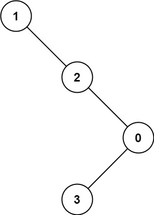

# 勇往直前的深度优先遍历

在线性结构中，按照顺序一个一个地看到所有的元素，称为线性遍历。在非线性结构中，由于元素之间的组织方式变得复杂，就有了不同的遍历行为。其中最常见的遍历有：深度优先遍历（Depth-First-Search）和广度优先遍历（Breadth-First-Search）。它们的思想非常简单，但是在算法的世界里发挥着巨大的作用。
> 友情提示：大家先不要纠结这里「Search」为什么翻译成「遍历」，可以认为「遍历」和「搜索」是一回事。
# 深度优先遍历的形象描述
<video  src="image/leetbookDFS/leetbookDFS.mp4"></video>