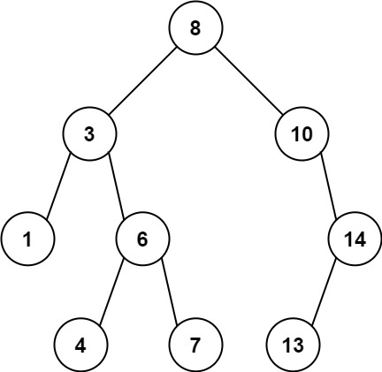
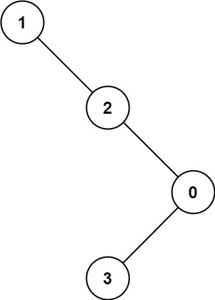

[力扣题目链接](https://leetcode.cn/problems/maximum-difference-between-node-and-ancestor/)

**给定二叉树的根节点 root，找出存在于 不同 节点 A 和 B 之间的最大值 V，其中 V = |A.val - B.val|，且 A 是 B 的祖先。**

**（如果 A 的任何子节点之一为 B，或者 A 的任何子节点是 B 的祖先，那么我们认为 A 是 B 的祖先）**

#### 示例1：



```
输入：root = [8,3,10,1,6,null,14,null,null,4,7,13]
输出：7
解释： 
我们有大量的节点与其祖先的差值，其中一些如下：
|8 - 3| = 5
|3 - 7| = 4
|8 - 1| = 7
|10 - 13| = 3
在所有可能的差值中，最大值 7 由 |8 - 1| = 7 得出。
```

#### 示例2：



```
输入：root = [1,null,2,null,0,3]
输出：3
```

#### 提示：

* 树中的节点数在 `2` 到 `5000` 之间。
* `0 <= Node.val <= 10<sup>5</sup>`

### 思路：

```javascript
/**
 * Definition for a binary tree node.
 * function TreeNode(val, left, right) {
 *     this.val = (val===undefined ? 0 : val)
 *     this.left = (left===undefined ? null : left)
 *     this.right = (right===undefined ? null : right)
 * }
 */
/**
 * @param {TreeNode} root
 * @return {number}
 */
var maxAncestorDiff = function(root) {
    let diff = 0
    const diffData = (node,min,max) =>{
        if(!node) return 0
        diff = Math.max(Math.abs(node.val-min),Math.abs(node.val-max))
        min = Math.min(min,node.val)
        max = Math.max(max,node.val)
        diff = Math.max(diff,diffData(node.left,min,max)) 
        diff = Math.max(diff,diffData(node.right,min,max)) 
        return diff
    }
  
    return diffData(root,root.val,root.val)
};
```

### 总结：

#### 复杂度

- 时间复杂度
- 时间复杂度：O(n)，其中n 是二叉树的节点数目。遍历二叉树的所有节点需要O(n)。
- 空间复杂度：O(n)。最坏情况下，二叉树退化为链表，递归栈的空间为O(n)。
