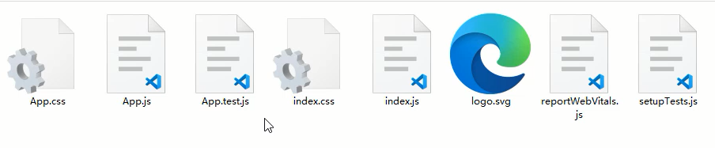
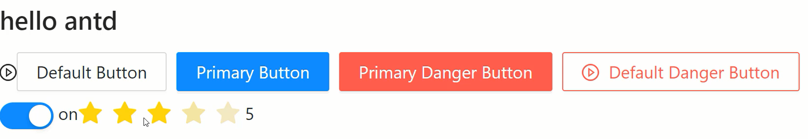
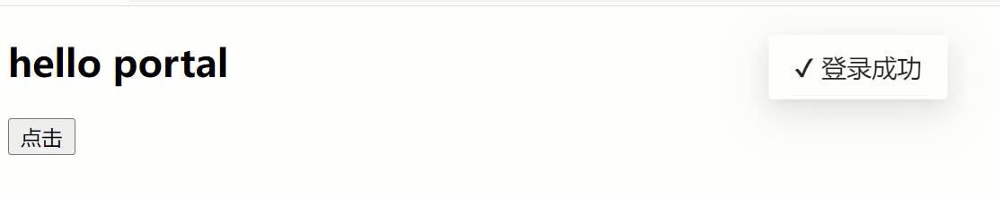

# React18扩展内容与脚手架使用 – 全面掌握React18特性 

## 脚手架安装及vsCode插件安装

### 脚手架的安装

React的脚手架我们采用官方提供的Create React App进行搭建，Create React App是一个用于学习 React 的舒适环境，也是用 React 创建新的单页应用的最佳方式。

它会配置你的开发环境，以便使你能够使用最新的 JavaScript 特性，提供良好的开发体验，并为生产环境优化你的应用程序。你需要在你的机器上安装Node >= 14.0.0 和 npm >= 5.6。

```shell
# 安装命令
npx create-react-app my-app
cd my-app
npm start
```

目录结构如下：

<div align=center>
    
    <div>Create React App目录结构</div>
</div>


主要开发代码在src目录下。

<div align=center>
    
    <div>src开发环境下的文件</div>
</div>


App.js为根组件，index.js为入口模块，index.css为全局样式文件。

### 插件的安装

首先需要在vsCode下安装，`ES7+ React/Redux/React-Native snippets`这个插件，他可以帮我们快速创建React组件的初始代码，也可以给JSX做一些提示操作。直接在vsCode的扩展中进行搜索即可安装。

可通过`rcc`快速创建一个类组件，可通过`rfc`快速创建一个函数组件。

除了vsCode插件外，还需要安装一个Chrome插件，React Developer Tools 这个工具，可以对React组件进行查看，并且可观察到组件传递数据的情况。

课件中已经提供了相关工具，直接在Chrome下进行安装即可。

<div align=center>
    
    <div>React Developer Tools</div>
</div>


### 脚手架下需要注意的点

- 注意点：<></>
- 注意点：import React from 'react'
- 注意点：<React.StrictMode>
- 注意点：脚手架下的注释
- 注意点：package.json中的eslint

<></>是<React.Fragment>的简写，在脚手架下可以采用这种简写方式，提供一个唯一根节点非常的有用。

import React from 'react' 这句话在React17之前是不能省略的，但是在React17版本之后是可以省略的，因为React17版本之后对JSX语法的解析有了新的转换方式，具体可参考：https://zh-hans.reactjs.org/blog/2020/09/22/introducing-the-new-jsx-transform.html

<React.StrictMode>为严格模式，可以检测到一些比较过时的语法，还有一些在操作React的时候的一些不规范写法等。

在脚手架下添加注释，可通过快捷键进行操作，通过`alt + shift + a`键来完成，非常的方便。

package.json中默认对eslint进行了支持，可找到`eslintConfig`属性进行一些eslint的设置，例如：`rules`字段。

## 脚手架下样式处理方式及Sass支持

在脚手架下对样式的处理方式非常的多，主要有：全局样式，Sass/Less支持，模块化CSS，CSS-in-JS，样式模块classnames等，下面就分别来看一下。

### 全局样式

在对应的jsx文件下创建的.css文件就是一个全局样式，在jsx引入后就可以在全局环境下生效。

```jsx
import './Welcome.css'
export default function Welcome() {
  return (
    <div className='Welcome'>
      <div className='box'>Welcome</div>
      <div className='box2'>Welcome</div>
    </div>
  )
}
```

这样操作很容易产生冲突，所以可以采用命名空间的方式来避免冲突，即最外层元素添加跟当前组件一样名字的选择器。

内部的其他选择器都是这个最外层选择器的后代选择器。

```css
// Welcome.css
.Welcome .box{
  color: yellow;
}
.Welcome .box2{
  width: 100px;
  height: 100px;
  background: blue;
}
```

不过这样写样式会很麻烦，可利用预编译CSS的嵌套写法来对代码进行改进，这里以Sass作为演示。

### 预编译CSS的支持

首先默认脚手架是不支持Sass或其他预编译CSS的，所以需要安装第三方模块来进行生效。

```shell
npm install sass
```

安装好后，就可以编写已.scss为后缀的文件了。

```scss
.Welcome{
  .box{
    width: 100px;
    height: 100px;
    background: red;
  }
  .box2{
    width: 100px;
    height: 100px;
    background: blue;
  }
}
```

### 模块化CSS

模块化的CSS，主要就是实现局部样式的能力，这样就只能在当前组件内生效，不会影响到其他的组件。模块化的CSS有格式上的要求，即`[name].module.css`

下面以Welcome组件举例：

```jsx
import style from './Welcome.module.css'
export default function Welcome() {
  return (
    <div>
      <div className={style.box}>Welcome</div>
      <div className={style.box2}>Welcome</div>
    </div>
  )
} 
```

这种局部的操作，style.box只会给指定的元素添加样式。

### CSS-in-JS

这种方法主要会把CSS代码直接写入到JSX文件内，这样可以不分成两个文件，而是只需要一个文件就可以完成一个独立的组件开发。

这种CSS-in-JS的实现是需要借助于第三方模块的，目前比较流行的是：`styled-components`这个模块。首先是需要下载。

```shell
npm install styled-components
```

```jsx
import styled from 'styled-components'
const Title = styled.h1`
  font-size: 1.5em;
  text-align: center;
  color: blue;
  background: red;
`;
const Text = styled.a`
  color: blue;
  background: red;
  &:hover {
    color: yellow;
  };
`;
export default function Welcome() {
    return (
        <div>
            <Title>我是一个标题</Title>
            <Text href="http://www.imooc.com">我是一个链接</Text>
        </div>
    )
}
```

### 样式模块classnames

有时候操作class样式的时候，往往普通的字符串很难满足我们的需求，所以可以借助第三方模块`classnames`，他允许我们操作多样式的时候可以以对象的形式进行控制。

```jsx
import './Welcome.css'
import classnames from 'classnames'
export default function Welcome() {
  //const myClass = 'box box2'
  const myClass = classnames({
    box: true,
    box2: true
  })
  return (
    <div className='Welcome'>
      <h2 className={myClass}>这是一个标题</h2>
    </div>
  )
}
```

## Ant Design框架的安装与使用（一）

### 什么是Ant Design框架

Ant Design是React的第三方UI组件库，类似于前面我们学习的Vue中的Element Plus。Ant Design是阿里巴巴旗下蚂蚁金服推出的开源框架，分为PC端与移动端。

PC端：https://ant.design

移动端：https://mobile.ant.design

下面演示PC端的使用方式，需要先下载安装，本小节安装的是"antd": "^4.24.0"这个版本，如果后续升级了，大家可以通过@方式安装当前小节中指定的版本。

```shell
npm install antd@4.24.0
```

除了在主入口文件中引入antd框架外，还需要引入他提供的antd全局样式文件。

```js
// index.css
@import '~antd/dist/antd.css'
```

在antd中如果要使用图标的话，需要单独下载并使用。

```shell
npm install @ant-design/icons
```

antd中基本组件的使用方式如下，例如：Button按钮组件，Space间距组件，Switch开关组件，Rate评分组件等：

```jsx
import { Button, Space, Switch, Rate } from 'antd'
import { PlayCircleOutlined } from '@ant-design/icons'
import { useState } from 'react'
export default function App() {
    const [ checked, setChecked ] = useState(true)
    const [ value, setValue ] = useState(3)
    return (
        <div>
            <h2>hello antd</h2>
            <PlayCircleOutlined />
            <Space>
                <Button>Default Button</Button>
                <Button type="primary">Primary Button</Button>
                <Button type="primary" danger>Primary Danger Button</Button>
                <Button danger icon={<PlayCircleOutlined />}>Default Danger Button</Button>
            </Space>
            <div>
                <Switch checked={checked} onChange={setChecked} /> { checked ? 'on' : 'off' }
                <Rate value={value} onChange={setValue} /> { value }
            </div>
        </div>
    )
}
```

<div align=center>
    
    <div>antd基本组件</div>
</div>


## Ant Design框架的安装与使用（二）

本小节我们继续来看一下，antd中的一些复杂组件的使用。

主要就是表单组件涉及的操作是比较多的，下面就一起来看一下。

```jsx
import { Button, Checkbox, Form, Input } from 'antd';
import { useState } from 'react';
export default function App() {
    const [username, setUsername] = useState('xiaoming')
    const handleFinish = (values) => {
        console.log(values)
    }
    const handleValuesChange = (values) => {
        setUsername(values.username)
    }
    return (
        <div>
            <h2>hello antd</h2>
            <Form
                className="login"
                labelCol={{
                    span: 8,
                }}
                wrapperCol={{
                    span: 16,
                }}
                onFinish={handleFinish}
                onValuesChange={handleValuesChange}
                initialValues={{username}}
                >
                <Form.Item 
                    label="用户名" 
                    name="username"
                    rules={[
                        {
                            required: true,
                            message: '用户名不能为空!',
                        },
                    ]}
                    >
                    <Input /> 
                </Form.Item>
                <Form.Item
                    wrapperCol={{
                        offset: 8,
                            span: 16,
                    }}>
                    <Checkbox />
                </Form.Item>
                <Form.Item
                    wrapperCol={{
                        offset: 8,
                            span: 16,
                    }}>
                    <Button htmlType='submit'>登录</Button>
                </Form.Item>
            </Form>
        </div>
    )
}
```

这里可以先把表单组件的结构编写完成，主要使用到<Form>和<Form.Item>这两个组件。

labelCol，wrapperCol属性主要是完成布局位置的，rules属性主要是进行表单校验的。

initialValues属性来添加初始值的，onFinish属性用于按钮触发提交后的事件函数。

### 逻辑组件

在antd中，还提供了很多逻辑组件，就是可以在JS中进行调用的组件，例如：弹出提示，通知框等。

```jsx
import { Button, message, notification } from 'antd';
export default function App() {
  const handleClick = () => {
    message.success('成功')
    notification.open({
      message: 'Notification Title',
      description: 'Notification description',
      placement: 'bottomRight'
    })
  }
  return (
    <div>
      <h2>hello antd</h2>
      <Button onClick={handleClick}>按钮</Button>
    </div>
  )
}
```


## 仿Ant Design的Button组件实现

前面小节我们已经对antd库有了了解，也学会了基本的使用。本小节要模拟实现一下antd中的Button组件，仿造实现的地址如下：https://ant.design/components/button-cn/。

首先在/src目录下创建一个新的目录，起名为/MyAntd，然后在这个文件夹下创建两个文件，即：/MyButton/MyButton.jsx 和 /MyButton/MyButton.scss。

接下来在/MyAntd下再创建一个index.js文件，作为所有组件的一个入口文件。

具体要实现组件的功能需求：

- 按钮类型
- 按钮尺寸
- 按钮文字
- 添加图标

```jsx
// /MyButton/MyButton.jsx

import React from 'react'
import './MyButton.scss'
import classnames from 'classnames'
import PropTypes from 'prop-types'
export default function MyButton(props) {
    const buttonClass = classnames({
        'my-button-default': true,
        [`my-button-${props.type}`]: true,
        [`my-button-${props.type}-danger`]: props.danger,
        [`my-button-${props.size}`]: true,
    })
    return (
        <button className={buttonClass}>{ props.icon } { props.children }</button>
    )
}
MyButton.propTypes = {
    type: PropTypes.string,
    size: PropTypes.string,
    danger: PropTypes.bool,
    icon: PropTypes.element
}
MyButton.defaultProps = {
    type: 'default',
    size: 'middle',
    danger: false
}
```

```scss
// /MyButton/MyButton.scss

.my-button{
    &-default{
        line-height: 1.5715;
        position: relative;
        display: inline-block;
        font-weight: 400;
        white-space: nowrap;
        text-align: center;
        background-image: none;
        border: 1px solid transparent;
        box-shadow: 0 2px 0 rgb(0 0 0 / 2%);
        cursor: pointer;
        transition: all 0.3s cubic-bezier(0.645, 0.045, 0.355, 1);
        -webkit-user-select: none;
        -moz-user-select: none;
        -ms-user-select: none;
        user-select: none;
        touch-action: manipulation;
        height: 32px;
        padding: 4px 15px;
        font-size: 14px;
        border-radius: 2px;
        color: rgba(0, 0, 0, 0.85);
        border-color: #d9d9d9;
        background: #fff;
        &-danger{
            color: #ff4d4f;
            border-color: #ff4d4f;
            background: #fff;
            box-shadow: 0 2px 0 rgb(0 0 0 / 5%);
        }
    }
    &-primary{
        color: #fff;
        border-color: #1890ff;
        background: #1890ff;
        box-shadow: 0 2px 0 rgb(0 0 0 / 5%);
        &-danger{
            color: #fff;
            border-color: #ff4d4f;
            background: #ff4d4f;
            box-shadow: 0 2px 0 rgb(0 0 0 / 5%);
        }
    }
    &-large{
        height: 40px;
        padding: 6.4px 15px;
        font-size: 16px;
        border-radius: 2px;
    }
    &-small{
        height: 24px;
        padding: 0 7px;
        font-size: 14px;
        border-radius: 2px
    }
}
```

开发好组件后，就去测试一下按钮组件的各种功能。

```jsx
import React from 'react'
import { MyButton } from './MyAntd'
import { PlayCircleOutlined } from '@ant-design/icons'
export default function App() {
    return (
        <div>
            <h2>hello myAntd</h2>
            <MyButton>按钮1</MyButton>
            <MyButton type="primary">按钮2</MyButton>
            <MyButton danger>按钮3</MyButton>
            <MyButton type="primary" danger>按钮4</MyButton>
            <MyButton type="primary" size="large">按钮5</MyButton>
            <MyButton type="primary" size="small">按钮6</MyButton>
            <MyButton type="primary" icon={<PlayCircleOutlined />}>按钮7</MyButton>
        </div>
    )
}
```

<div align=center>
    
    <div>仿antd按钮组件</div>
</div>


## 仿Ant Design的Rate组件实现

在本小节中将继续来仿造一个antd中的组件，就是Rate评分组件，仿造实现的地址如下：huhttps://ant.design/components/rate-cn/。

首先还是在/MyAntd文件夹下创建两个文件，即：/MyRate/MyRate.jsx 和 /MyRate/MyRate.scss。

具体要实现组件的功能需求：

- 最大分值
- 选中分值
- 事件交互

```jsx
// /MyRate/MyRate.jsx

import React, { useState } from 'react'
import './MyRate.scss'
import '../../iconfont/iconfont.css'
import classnames from 'classnames'
import PropTypes from 'prop-types'

export default function MyRate(props) {
    const [ clickValue, setClickValue ] = useState(props.value)
    const [ mouseValue, setMouseValue ] = useState(props.value)
    const stars = [];
    const handleMouseEnter = (index) => {
        return () => {
            setMouseValue(index+1)
        }
    }
    const handleMouseLeave = () => {
        setMouseValue(clickValue)
    }
    const handleMouseDown = (index) => {
        return () => {
            setClickValue(index+1)
            props.onChange(index+1)
        }
    }
    for(let i=0;i<props.count;i++){
        const rateClass = classnames({
            iconfont: true,
            'icon-xingxing': true,
            active: mouseValue > i ? true : false
        })
        stars.push(<i key={i} className={rateClass} onMouseEnter={handleMouseEnter(i)} onMouseLeave={handleMouseLeave} onMouseDown={handleMouseDown(i)}></i>);
    }
    return (
        <div className="my-rate">{stars}</div>
    )
}
MyRate.propTypes = {
    count: PropTypes.number,
    value: PropTypes.number,
    onChange: PropTypes.func
}
MyRate.defaultProps = {
    count: 5,
    value: 0,
    onChange: function(){}
}
```

```scss
// /MyRate/MyRate.scss

.my-rate{
  i{
    font-size: 20px;
    color: #ccc;
  }
  .active{
    color: #fadb14;
  }
}
```

开发好组件后，就去测试一下评分组件的各种功能。

```jsx
import React, { useState } from 'react'
import { MyRate } from './MyAntd'
export default function App() {
    const [value, setValue] = useState(3)
    return (
        <div>
            <h2>hello myAntd</h2>
            <MyRate></MyRate>
            <MyRate count={4}></MyRate>
            <MyRate value={value} onChange={setValue} ></MyRate> { value }
        </div>
    )
}
```

<div align=center>
    
    <div>仿antd评分组件</div>
</div>


## react-transition-group模块实现动画功能

### react-transition-group模块

这是一个第三方模块，主要用于完成React动画的，官网地址：http://reactcommunity.org/react-transition-group，需要提前下载安装。

```shell
npm install react-transition-group
```

首先在使用react-transition-group完成动画之前，需要对涉及到的样式做一定的了解，主要有三组样式选择器：

- *-enter  *-enter-active  *-enter-done
- *-exit  *-exit-active  *-exit-done
- *-appear  *-appear-active  *-appear-done

enter表示从隐藏到显示的动画；exit表示从显示到隐藏的动画；appear表示初始添加的动画。

其中带有active标识的表示动画过程中，带有done标识的表示动画结束时。

下面就创建两个文件，即：animate.jsx 和 animate.scss，代码如下：

```jsx
// animate.jsx
import React, { useState, useRef } from 'react'
import './animate.scss'
import { CSSTransition } from 'react-transition-group'
export default function App() {
  const [prop, setProp] = useState(true)
  const nodeRef = useRef(null)
  const handleClick = () => {
    setProp(!prop)
  }
  const handleEntered = () => {
    console.log('entered')
  }
  return (
    <div className="Animate">
      <h2>hello animate</h2>
      <button onClick={handleClick}>点击</button>
      <CSSTransition appear nodeRef={nodeRef} in={prop} timeout={1000} classNames="fade" unmountOnExit onEntered={handleEntered}>
        <div className="box" ref={nodeRef}></div>
      </CSSTransition>
    </div>
  )
}
```

```scss
// animate.scss

.Animate{
    .box{
        width: 150px;
        height: 150px;
        background: red;
        opacity: 1;
    }
    .fade-enter{
        opacity: 0;
    }
    .fade-enter-active{
        opacity: 1;
        transition: 1s;
    }
    .fade-enter-done{
        opacity: 1;
    }
    .fade-exit{
        opacity: 1;
    }
    .fade-exit-active{
        opacity: 0;
        transition: 1s;
    }
    .fade-exit-done{
        opacity: 0;
    }
    .fade-appear{
        opacity: 0;
    }
    .fade-appear-active{
        opacity: 1;
        transition: 1s;
    }
    .fade-appear-done{
        opacity: 1;
    }
}
```

首先模块会提供一个<CSSTransition>组件用于实现动画功能，classNames="fade"来匹配对应的CSS动画选择器。

in={prop}用于控制显示隐藏的状态切换，timeout={1000}要跟选择器中的过渡时间相匹配，这样才可以完成动画的时间。

nodeRef={nodeRef} 和 ref={nodeRef} 在内部会把要动画的元素联系起来。

appear属性是添加初始动画效果，unmountOnExit属性用于动画结束后删除元素。

onEntered={handleEntered}是动画结束后触发的回调函数。

最终完成了一个具有淡入淡出的动画效果。

## createPortal传送门与逻辑组件的实现

### createPortal传送门

传送门就是把当前容器内的结构传递到容器外，主要是为了解决一些布局上的问题。在React中通过ReactDOM.createPortal()将子节点渲染到已 DOM 节点中的方式，从而实现传送门功能。

```jsx
import React, { useState } from 'react'
import ReactDOM from 'react-dom'
function Message() {
    return ReactDOM.createPortal( <div>hello Message</div>, document.body )
}
export default function App() {
    const [ show, setShow ] = useState(false)
    const handleClick = () => {
        setShow(true)
    }
    return (
        <div>
            <h2>hello portal</h2>
            <button onClick={handleClick}>点击</button>
            { show && <Message /> }
        </div>
    )
}
```

上面的案例中，是非常典型的弹出消息框，需要相对于body进行偏移，所以需要把这个弹出消息框从当前容器中传输到body下。

但是这种弹出框一般在组件中都会通过逻辑组件进行实现，并不会直接去编写结构，那么该如何实现一个逻辑组件呢？

```jsx
import { useRef, useState } from 'react'
import ReactDOM from 'react-dom/client';
import './05_portal.scss'
import { CSSTransition } from 'react-transition-group'
const message = {
    success(text){
        const message = ReactDOM.createRoot(document.querySelector('#message'))
        message.render(<Message text={text} icon="✔" />)
    }
}
function Message(props) {
    const [prop, setProp] = useState(true)
    const nodeRef = useRef(null)
    const handleEntered = () => {
        setTimeout(()=>{
            setProp(false)
        }, 2000)
    }
    return (
        <CSSTransition appear nodeRef={nodeRef} in={prop} timeout={1000} classNames="Message" unmountOnExit onEntered={handleEntered}>
            <div className="Message" ref={nodeRef}>{props.icon} {props.text}</div>
        </CSSTransition>
    )
}
export default function App() {
    const handleClick = () => {
        message.success('登录成功');
    }
    return (
        <div>
            <h2>hello portal</h2>
            <button onClick={handleClick}>点击</button>
        </div>
    )
}
```

附带逻辑组件加动画效果，还有对应的CSS样式。

```scss
// 05_portal.scss

.Message{
    display: inline-block;
    padding: 10px 16px;
    background: #fff;
    border-radius: 2px;
    box-shadow: 0 3px 6px -4px #0000001f, 0 6px 16px #00000014, 0 9px 28px 8px #0000000d;
    pointer-events: all;
    position: absolute;
    top: 20px;
    left: 50%;
    transform: translateX(-50%);
}
.Message-enter{
    opacity: 0;
    top: 10px;
}
.Message-enter-active{
    opacity: 1;
    top: 20px;
    transition: 1s;
}
.Message-enter-done{
    opacity: 1;
    top: 20px;
}
.Message-exit{
    opacity: 1;
    top: 20px;
}
.Message-exit-active{
    opacity: 0;
    top: 10px;
    transition: 1s;
}
.Message-exit-done{
    opacity: 0;
    top: 10px;
}
.Message-appear{
    opacity: 0;
    top: 10px;
}
.Message-appear-active{
    opacity: 1;
    top: 20px;
    transition: 1s;
}
.Message-appear-done{
    opacity: 1;
    top: 20px;
}
```

<div align=center>
    
    <div>逻辑组件弹出提示框</div>
</div>


## React.lazy与React.Suspense与错误边界

### React.lazy与React.Suspense

在React中可以通过React.lazy方法进行组件的异步加载，这样就会做到只有使用的时候才会去加载，从而提升性能。

```jsx
import React, { lazy, Suspense } from 'react'
import { useState } from 'react'
const Welcome = lazy(()=> import('./components/Welcome'))
const Welcome2 = lazy(()=> import('./components/Welcome2'))
export default function App() {
    const [ show, setShow ] = useState(true)
    const handleClick = () => {
        setShow(false)
    }
    return (
        <div>
            <h2>hello lazy</h2>
            <button onClick={handleClick}>点击</button>
            <Suspense fallback={ <div>loading...</div> }>
                { show ? <Welcome /> : <Welcome2 /> }
                </ErrorBoundary>
        </div>
    )
}
```

这里需要配合React.Suspense方法，来完成异步组件加载过程中的loading效果。

### 错误边界

在React中如果组件发生了错误，会导致整个页面清空，如果只想让有问题的组件提示，而不影响到其他组件的话，可以使用错误边界组件进行处理。

这里要注意，目前错误边界组件只能用类组件进行编写。

```jsx
// ./07_ErrorBoundary.jsx
import React, { Component } from 'react'
export default class ErrorBoundary extends Component {
    constructor(props) {
        super(props);
        this.state = { hasError: false };
    }
    static getDerivedStateFromError(error) {
        // 更新 state 使下一次渲染能够显示降级后的 UI
        return { hasError: true };
    }
    render() {
        if (this.state.hasError) {
            // 你可以自定义降级后的 UI 并渲染
            return <h1>Something went wrong.</h1>;
        }
        return this.props.children; 
    }
}
```

使用错误边界组件，可以结合上面的异步组件一起。

```jsx
import React, { lazy, Suspense } from 'react'
import { useState } from 'react'
import ErrorBoundary from './07_ErrorBoundary'

const Welcome = lazy(()=> import('./components/Welcome'))
const Welcome2 = lazy(()=> import('./components/Welcome2'))

export default function App() {
    const [ show, setShow ] = useState(true)
    const handleClick = () => {
        setShow(false)
    }
    return (
        <div>
            <h2>hello lazy</h2>
            <button onClick={handleClick}>点击</button>
            <ErrorBoundary>
                <Suspense fallback={ <div>loading...</div> }>
                    { show ? <Welcome /> : <Welcome2 /> }
                </Suspense>
            </ErrorBoundary>
        </div>
    )
}
```

当<Welcome>组件发生错误的时候，就只会在局部提示错误信息，并不影响到React的其他组件。