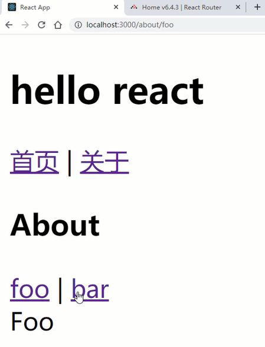
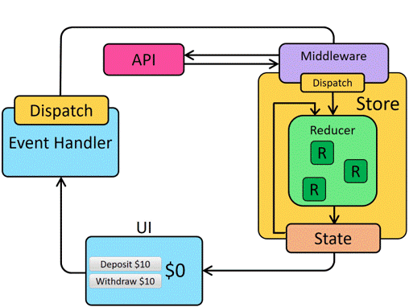
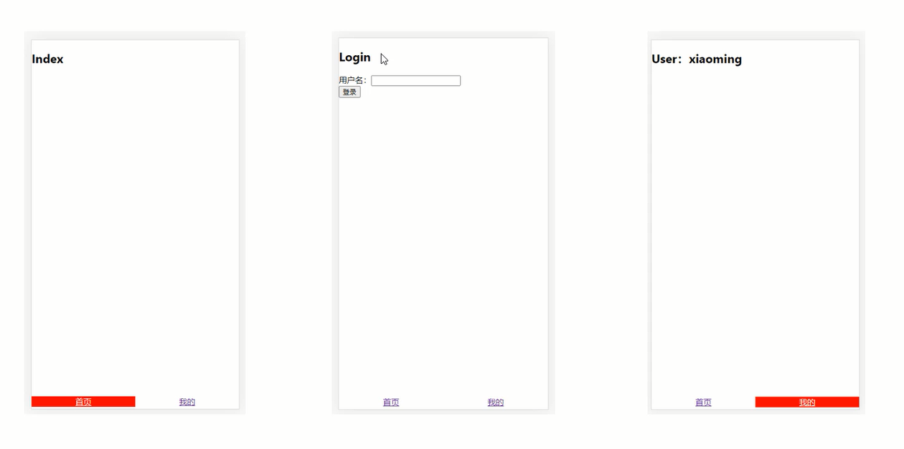

# ReactRouter路由与Redux状态管理 – 组织与架构应用

## ReactRouterV6.4 基础路由搭建

### 路由的安装

通过npm来安装react-router-dom模块。

```shell
# 安装命令
npm i react-router-dom
```

安装好的版本为：`"react-router-dom": "^6.4.3"`。

接下来在脚手架的/src目录下，创建一个/router文件夹和一个/router/index.js文件，这个index.js文件就是路由的配置文件。

那么React中的路由模式跟Vue中的路由模式是一样的，分为：history模式(HTML5模式)和hash模式两种。

- history模式：createBrowserRouter
- hash模式：createHashRouter

```javascript
import { createBrowserRouter, createHashRouter } from 'react-router-dom'
//路由表
export const routes = [];
//路由对象
const router = createBrowserRouter(routes);
export default router;
```

接下来让路由配置文件与React结合，需要在主入口index.js进行操作，如下：

```javascript
import { RouterProvider } from 'react-router-dom'
import router from './router';
const root = ReactDOM.createRoot(document.getElementById('root'));
root.render(
  <React.StrictMode>
    <RouterProvider router={router}></RouterProvider>
  </React.StrictMode>
);
```

路由表的配置字段如下：

- path：指定路径
- element：对应组件
- children：嵌套路由

```javascript
//路由表
export const routes = [
    {
        path: '/',
        element: <App />,
        children: [
            {
                path: '',
                element: <Home />
            },
    		{
                path: 'about',
                element: <About />,
                children: [
                    {
                        path: 'foo',
                        element: <Foo />,
                    },
                    {
                        path: 'bar',
                        element: <Bar />,
                    }
    			]
    		}
        ]
    }
];
```

接下来就是显示路由区域，利用<outlet>组件

```jsx
import React from "react";
import { Outlet, Link } from 'react-router-dom'
function App() {
  return (
    <div className="App">
      <h2>hello react</h2>
      <Link to="/">首页</Link> | <Link to="/about">关于</Link>
      <Outlet />
    </div>
  );
}
export default App;
```

可以看到 <Link>组件用于声明式路由切换使用。同样<outlet>组件也可以给嵌套路由页面进行使用，从而完成二级路由的切换操作。

```jsx
import React from 'react'
import './About.scss'
import { Outlet, Link } from 'react-router-dom'
export default function About() {
  return (
    <div>
      <h3>About</h3>
      <Link to="/about/foo">foo</Link> | <Link to="/about/bar">bar</Link>
      <Outlet />
    </div>
  )
}
```

<div align=center>
    
    <div>react路由基本搭建</div>
</div>


## 动态路由模式与编程式路由模式

### 动态路由模式

动态路由是根据不同的URL，可以访问同一个组件。在React路由中，通过path字段来指定动态路由的写法。

```javascript
{
    path: 'foo/:id',
    element: <Foo />
}
```

其中`id`就是变量名，可以在组件中用`useParams`来获取到对应的值。

```jsx
import { useParams } from 'react-router-dom'
export default function Foo() {
  const params = useParams()
  return (
    <div>Foo, { params.id }</div>
  )
}
```

### 带样式的声明式路由NavLink

跟<Link>组件的区别就是，可以添加样式。

```jsx
import { Outlet, NavLink } from 'react-router-dom'
export default function About() {
	return (
        <div>
            <NavLink to="/about/foo/123">foo 123</NavLink> | <NavLink to="/about/foo/456">foo 456</NavLink>
        </div>
   	)
}
```

默认的样式名为`.active`，需要在对应的css文件中引入。

```scss
.active{
  background: red;
  color: white;
}
```

当然也可以自定义选择器的名字，代码如下：

```jsx
import { Outlet, NavLink } from 'react-router-dom'
export default function About() {
	return (
        <div>
            <NavLink to="/about/foo/123" className={({isActive})=> isActive ? 'active2' : '' }>foo 123</NavLink> | <NavLink to="/about/foo/456" className={({isActive})=> isActive ? 'active2' : '' }>foo 456</NavLink>
        </div>
   	)
}
```

这时选择器变成了`.active2`。

### 编程式路由

编程式路由是需要在JS逻辑中进行调用的跳转路由的方式。

```jsx
import { Outlet, useNavigate } from 'react-router-dom'
export default function About() {
    const navigate = useNavigate()
    const handleClick1 = () => {
        navigate('/about/foo/123')
    }
    const handleClick2 = () => {
        navigate('/about/foo/456')
    }
    const handleClick3 = () => {
        navigate('/about/bar')
    }
	return (
        <div>
            <button onClick={handleClick1}>foo 123</button> | <button onClick={handleClick2}>foo 456</button> | <button onClick={handleClick3}>bar</button>
        </div>
   	)
}
```

这样就可以更加灵活的控制触发的时机以及触发元素的样式。

## useSearchParams与useLocation函数

### useLocation函数

用于获取路由URL的信息的，返回一个location对象。

```jsx
import { useLocation } from 'react-router-dom'
export default function Bar() {
  const location = useLocation()
  console.log(location)
  return (
    <div>Bar</div>
  )
}
```

location对象相关属性如下：

- hash：哈希值
- key：唯一标识
- pathname：路径
- search：query值
- state：隐式数据

一般传递的数据就是需要拿到query值，不过要通过search去解析对应的query值是比较麻烦的，需要把字符串解析成对象。

所以可以利用useSearchParams函数来获取query数据。

### useSearchParams函数

用于处理URL中的携带数据。

```jsx
import { useSearchParams } from 'react-router-dom'

export default function Bar() {
  const [searchParams, setSearchParams] = useSearchParams()
  console.log( searchParams.get('age') );
  const handleClick = () => {
	setSearchParams({ age: 22 })
  }
  return (
    <div onClick={handleClick}>Bar</div>
  )
}
```

可以进行数据的获取，也可以对URL的query进行设置操作，非常的方便。

## 默认路由展示与重定向路由与404处理

### 默认路由

在当前路由没有匹配成功的时候，添加一个默认的展示内容，这就是React中的默认路由。

```javascript
children: [
    // 默认路由
    {
        index: true,
        element: <div>默认的内容</div>
    },
    {
        path: 'foo',
        element: <Foo />
    },
    {
        path: 'bar',
        element: <Bar />
    }
 ]
```

当没有匹配到foo或bar的时候，会展示默认路由的内容，一旦匹配成功后，就会替换掉默认路由。

### 重定向路由

通过访问的URL跳转到另一个URL上，从而实现重定向的需求。

```javascript
import { createBrowserRouter, createHashRouter, Navigate } from 'react-router-dom'

children: [
    // 默认路由
    {
        index: true,
        element: <Navigate to="/about/foo/123" />,
    },
    {
        path: 'foo',
        element: <Foo />
    },
    {
        path: 'bar',
        element: <Bar />
    }
 ]
```

<Navigate>组件就是实现重定向需求的组件。

### 处理404页面

可以通过路由中自带的errorElement选项来完成全局404需求。

```javascript
export const routes = [
  {
    path: '/',
    element: <App />,
    errorElement: <div>404</div>,
  }
]
```

也可以通过`path: '*'`来实现局部404需求。

```javascript
export const routes = [
  {
    path: '/',
    element: <App />
  },
  {
    path: '*',
 	element: <div>404</div>
  }
]

```

这种局部404，可以在二级路由下进行设置。

## 路由loader函数与redirect方法

### loader函数

loader函数进行路由前触发，配合redirect做权限拦截。还可以通过useLoaderData()获取loader函数返回的数据。

```jsx
{
    path: 'bar',
    element: <Bar />,
    loader: async() => {
        let ret = await new Promise((resolve)=>{
            setTimeout(()=>{
                resolve({errcode: 0})
            }, 2000)
        })
        return ret; 
    }
}
```

在<Bar>这个组件内就可以通过`useLoaderData`函数来获取到ret的值。

```jsx
import { useLoaderData } from 'react-router-dom'
export default function Bar() {
  const data = useLoaderData()
  console.log(data)
  return (
    <div>Bar</div>
  )
}
```

### redirect方法

在`loader`函数中是没有办法使用<Navigate>组件进行重定向操作的，所以在React路由中提供了，另一种重定向的操作，即`redirect`函数。

```javascript
{
    path: 'bar',
    element: <Bar />,
    loader: async() => {
        let ret = await new Promise((resolve)=>{
            setTimeout(()=>{
                resolve({errcode: Math.random() > 0.5 ? 0 : -1})
            }, 2000)
        })
        if(ret.errcode === 0){
            return ret;
        }
        else{
            return redirect('/login')
        }
    }
}
```

## 自定义全局守卫与自定义元信息

### 自定义全局守卫

可以通过给根组件进行包裹的方式来实现全局守卫的功能，即访问根组件下面的所有子组件都要先通过守卫进行操作。

在/src/components/BeforeEach.jsx下创建守卫的组件。继续进行`BeforeEach.jsx`代码的编写。

```jsx
import React from 'react'
import { Navigate } from 'react-router-dom'
import { routes } from '../../router';
export default function BeforeEach(props) {
  if(true){
    return <Navigate to="/login" />
  }
  else{
    return (
      <div>{ props.children }</div>
    )
  }
}
```

根据判断的结果，是否进入到组件内，还是重定向到其他的组件内。

接下来就是怎么样去调用BeforeEach.jsx，通过路由配置文件引入，如下：

```javascript
export const routes = [
  {
    path: '/',
    element: <BeforeEach><App /></BeforeEach>
  }
]
```

### 自定义元信息

一般情况下，不同的路由获取到的信息是不一样的，可以通过自定义元信息来完成操作。

```jsx
{
    path: 'about',
    element: <About />,
    meta: { title: 'about' },
    children: [
        {
            path: 'foo/:id',
            element: <Foo />,
            meta: { title: 'foo', auth: false },
        },
        {
            path: 'bar',
            element: <Bar />,
            meta: { title: 'bar', auth: true },
        }
    ]
}
```

这样可以通过全局守卫`BeforeEach.jsx`来获取到meta元信息的数据，需要配合`useLocation`和`matchRoutes`这两个方法。

```jsx
import React from 'react'
import { useLocation, matchRoutes, Navigate } from 'react-router-dom'
import { routes } from '../../router';
export default function BeforeEach(props) {
  const location = useLocation();
  const matchs = matchRoutes(routes, location)
  const meta = matchs[matchs.length-1].route.meta
  if(meta.auth){
    return <Navigate to="/login" />
  }
  else{
    return (
      <div>{ props.children }</div>
    )
  }
}
```

## Redux状态管理的基本流程

### Redux状态管理库

Redux就像我们前面学习Vue中的Vuex或Pinia是一样的，专门处理状态管理的。只不过Redux比较独立，可以跟很多框架结合使用，不过主要还是跟React配合比较好，也是最常见的React状态管理的库。

官网网站：https://redux.js.org/

需要安装才能使用，即：`npm i redux`

要想很好的理解Redux的设计思想，就要看懂下面这张Redux基本流程图。

<div align=center>
    
    <div>redux基本流程图</div>
</div>


在图示当中，各部分的分工如下：

- State：用于存储共享数据
- Reducer：用于修改state数据的方法
- Middleware：用于扩展一些插件来完成异步的操作
- Dispatch：用于触发Reducer或Middleware

下面就来演示一下Redux代码的基本使用，首先在/src文件夹下创建/store文件夹和/store/index.js状态管理的配置文件。

```javascript
import { createStore } from 'redux'
function counterReducer(state={count: 0}, action) {
    switch(action.type){
        case 'inc':
  			return {count: state.count + 1}
        default:
            return state;
    }
}
const store = createStore(counterReducer)
export default store
```

这样store对象就可以在其他组件中进行使用了，例如在<Foo>组件中。

```jsx
import React from 'react'
import './Foo.scss'
import store from '../../store'
import { useState } from 'react'

export default function Foo() {
  const [count, setCount] = useState(store.getState().count)
  const handleClick = () => {
    store.dispatch({
      type: 'inc'
    })
  }
  store.subscribe(()=>{
    setCount(store.getState().count)
  })
  return (
    <div>
      <button onClick={handleClick}>修改count</button>
      Foo, { count }</div>
  )
}
```

这段代码中的`store.getState().count`就是用于获取到count的值。那么如何进行count的修改呢？需要调用dispatch方法来触发对应的counterReducer函数。

虽然count值确实被修改了，但是页面并没有同步发生改变，这主要就是因为需要通过`subscribe`方法进行监听，在监听到count改变后，再去触发对应的重渲染。

这样页面就会跟着方法变化了，不过这种做法非常的不方便，所以下一个小节会使用一个第三方模块`react-redux`来简化对Redux的使用。

## react-redux简化对Redux的使用

### react-redux库

因为Redux是一个独立的库，所以和React结合还是不够方便，因此就诞生了react-redux这个库，这个库可以让Redux于React结合的更加简单轻松，属于Redux的一个辅助模块。

主要提供的API有：

- <Provider store={store}> 
- useSelector
- useDispatch

<Provider>组件主要是注册状态管理与React结合，并且可以自动完成重渲染的操作。

useSelector，useDispatch都是react-redux库提供的use函数，可以获取共享状态以及修改共享状态。

```jsx
import React from 'react'
import './Bar.scss'
import { useSelector } from 'react-redux'
export default function Bar() {
  const count = useSelector((state)=> state.counter.count)
  const handleClick = () => {
    dispatch({
      type: 'inc',
      payload: 5
    })
  }
  return (
    <div>
     <button onClick={handleClick}>修改count</button>     
     Bar, { count }
    </div>
  )
}
```

在主模块中进行注册。

```javascript
import { RouterProvider } from 'react-router-dom'
import router from './router';
import { Provider } from 'react-redux'
import store from './store';
const root = ReactDOM.createRoot(document.getElementById('root'));
root.render(
  <React.StrictMode>
    <Provider store={store}>
      <RouterProvider router={router}></RouterProvider>
    </Provider>
  </React.StrictMode>
);
```

## 如何处理多个reducer函数及Redux模块化

### 模块化Redux

对于多个共享状态数据的时候，最好进行分离操作，独立成一个一个的模块，这样后期维护起来会非常的方便。

需要使用一个`combineReducers`方法来处理多个reducer函数，还需要添加命名空间。

具体操作为，给/store文件夹下添加/modules文件夹，并创建counter.js文件。

```javascript
function counterReducer(state={count: 0}, action){
  switch(action.type){
    case 'counter/inc': 
      const count = state.count + action.payload;
      return { count, doubleCount: count * 2 }
    default: 
      state.doubleCount = state.count * 2
      return state;
  }
}
export default counterReducer
```

现在可以再抽离一个模块出来，message.js模块。

```javascript
function messageReducer(state={msg: 'hello'}, action){
  switch(action.type){
    case 'message/change': 
      const msg = action.payload
      return { msg, upperMsg: msg.toUpperCase() }
    default: 
      state.upperMsg = state.msg.toUpperCase()
      return state;
  }
}
export default messageReducer
```

在状态管理的index.js文件中，完成模块的初始化操作。

```javascript
import { createStore, combineReducers } from 'redux'
import { composeWithDevTools } from 'redux-devtools-extension'
import counterReducer from './modules/counter';
import messageReducer from './modules/message';
const store = createStore(combineReducers({
  counter: counterReducer,
  message: messageReducer
}), composeWithDevTools)
export default store;
```

使用上需要带上counter或message的命名空间。

```jsx
import React from 'react'
import './Foo.scss'
import { useSelector, useDispatch } from 'react-redux'
import { counterTestAction } from '../../store/modules/counter'
export default function Foo() {
  const count = useSelector((state)=> state.counter.count)
  const doubleCount = useSelector((state)=> state.counter.doubleCount)
  const msg = useSelector((state)=> state.message.msg)
  const upperMsg = useSelector((state)=> state.message.upperMsg)
  const dispatch = useDispatch();
  const handleClick = () => {
    dispatch({
      type: 'counter/inc',
      payload: 5
    })
    dispatch({
      type: 'message/change',
      payload: 'hi'
    })
  }
  return (
    <div>
      <button onClick={handleClick}>修改count</button>
      Foo, {count}, {doubleCount}, {msg}, {upperMsg}</div>
  )
}
```

这里也模拟了类似于Vue中的计算属性，doubleCount和upperMsg。

## redux-thunk中间件处理异步操作

### redux-thunk中间件

在Redux中进行异步处理需要使用，redux-thunk这个中间件来完成。首先需要安装：`npm i redux-thunk`。

然后需要让redux-thunk中间件在Redux配置文件中生效。

```javascript
import { createStore, combineReducers, applyMiddleware } from 'redux'
import { composeWithDevTools } from 'redux-devtools-extension'
import thunk from 'redux-thunk'
import counterReducer from './modules/counter';
import messageReducer from './modules/message';
const store = createStore(combineReducers({
  counter: counterReducer,
  message: messageReducer
}), composeWithDevTools(applyMiddleware(thunk)))
export default store;
```

redux-thunk中间件，可以使dispatch方法除了可以接收对象以外，还可以接收回调函数。

```javascript
// /store/modules/counter.js
export function counterTestAction(){
  return (dispatch) => {
    return new Promise((resolve)=>{
      setTimeout(()=>{
        resolve('response data')
      }, 2000)
    })
  }
}
```

```javascript
import { counterTestAction } from '../../store/modules/counter'

dispatch(counterTestAction()).then((res)=>{
    dispatch({type: 'counter/inc', payload: 5})
    console.log(res)   // 'response data'
})
```

这样就可以在异步操作完成后，再次调用同步的reducer函数了，从而完成异步加同步的联动操作。

## Redux-Toolkit(RTK)改善Redux使用体验

### Redux-Toolkit(RTK)库

Redux在使用上还是有很多不方便的地方，所以提供了Redux-Toolkit(RTK)这个模块，通过这么模块可以更方便的处理Redux的操作，下面列举一些RTK的好处：

- 可以自动跟redux devtools结合，不需要再下载模块进行生效
- 数据不需要再通过返回值进行修改，像Vue一样可以直接修改
- 内置了 redux-thunk 这个异步插件
- 代码风格更好，采用选项式编写程序

下面就采用RTK的方式来编写状态管理模块counter.js和message.js。

```jsx
// /store/modules/counter.js
import { createSlice } from '@reduxjs/toolkit'
const initialState = {
  count: 0
}
const counterSlice = createSlice({
  // dispatch('counter/inc')
  name: 'counter',
  initialState: {
    ...initialState,
    doubleCount: initialState.count * 2
  },
  reducers: {
    inc(state, action){
      state.count += action.payload
      state.doubleCount = state.count * 2
    }
  }
})
export default counterSlice.reducer
```

```javascript
// /store/modules/message.js
import { createSlice } from '@reduxjs/toolkit'
const initialState = {
  msg: 'hello'
}
const messageSlice = createSlice({
  // dispatch('message/change')
  name: 'message',
  initialState: {
    ...initialState,
    upperMsg: initialState.msg.toUpperCase()
  },
  reducers: {
    change(state, action){
      state.msg = action.payload
      state.upperMsg = state.msg.toUpperCase()
    }
  }
})
export default messageSlice.reducer
```

可以发现RTK采用配置写法，更加清晰并且一目了然。而且RTK下可以直接进行数据的修改，不再需要通过返回值来进行修改，底层类似于Vuex的方式就是利用new Proxy直接监控数据的改变。

下面是在主模块中进行配置RTK模块的具体步骤。

```javascript
// /store/index.js
import { configureStore } from '@reduxjs/toolkit'
import counterReducer from './modules/counter';
import messageReducer from './modules/message';
const store = configureStore({
  reducer: {
    // state.counter.count
    counter: counterReducer,
    message: messageReducer
  }
})
export default store;
```

配置好后，在使用上是没有任何变化的，依然采用react-redux来进行操作。

## Redux-Toolkit(RTK)如何处理异步任务

### createAsyncThunk方法

在RTK中是通过createAsyncThunk方法来进行异步处理的，并且还提供了一个配置选项extraReducers来处理额外的reducer。

```javascript
// /store/modules/message.js
import { createSlice, createAsyncThunk } from '@reduxjs/toolkit'
const initialState = {
  msg: 'hello'
}
export const messageTestAction = createAsyncThunk('message/testAction', async ()=>{
  const ret = await new Promise((resolve)=>{
    setTimeout(()=>{
      resolve('response data')
    }, 2000)
  }) 
  return ret;
})
const messageSlice = createSlice({
  // dispatch('message/change')
  name: 'message',
  initialState: {
    ...initialState,
    upperMsg: initialState.msg.toUpperCase()
  },
  reducers: {
    change(state, action){
      state.msg = action.payload
      state.upperMsg = state.msg.toUpperCase()
    }
  },
  extraReducers: {
    [messageTestAction.fulfilled](state, action){
      state.msg = action.payload
      state.upperMsg = state.msg.toUpperCase()
    }
  }
})
export default messageSlice.reducer
```

extraReducers会得到三种状态，fulfilled，rejected，pending，这样可以对应异步操作的三种情况，成功，失败，等待。在成功后就可以触发额外的代码，这样就可以进行后续的同步reducer的调用或处理一些异步后的数据等。

在RTK中内置了redux-thunk这个模块，所以我们并不需要下载额外的模块，只需要把异步方法提供处理，并且让dispatch方法进行调用就好。

```jsx
import { useSelector, useDispatch } from 'react-redux'
import { messageTestAction } from '../../store/modules/message'
export default function Foo() {
  const count = useSelector((state)=> state.counter.count)
  const doubleCount = useSelector((state)=> state.counter.doubleCount)
  const msg = useSelector((state)=> state.message.msg)
  const upperMsg = useSelector((state)=> state.message.upperMsg)
  const dispatch = useDispatch()
  const handleClick = () => {
    dispatch(messageTestAction()).then((res)=>{  
      dispatch({
        type: 'message/change',
        payload: res.payload
      })
    })
  }
  return (
    <div>
      <button onClick={handleClick}>修改count</button>
      Foo, {count}, {doubleCount}, {msg}, {upperMsg}</div>
  )
}
```

## 通过redux-persist进行数据持久化处理

### redux-persist模块

redux-persist模块是对状态管理进行持久化处理的，默认数据是不会被保存下来的，需要长期存储改变的共享数据就需要使用持久化模块。

下面是在状态管理的入口模块中进行持久化的配置操作。

```javascript
import { configureStore } from '@reduxjs/toolkit'
import counterReducer from './modules/counter';
import messageReducer from './modules/message';
import {
  persistStore,
  persistReducer,
  FLUSH,
  REHYDRATE,
  PAUSE,
  PERSIST,
  PURGE,
  REGISTER,
} from 'redux-persist'
import storage from 'redux-persist/lib/storage'

const persistConfig = {
  key: 'root',
  version: 1,
  storage,
  whitelist: ['count']
}

const store = configureStore({
  reducer: {
    // state.counter.count
    counter: persistReducer(persistConfig, counterReducer),
    message: messageReducer
  },
  middleware: (getDefaultMiddleware) =>
    getDefaultMiddleware({
      serializableCheck: {
        ignoredActions: [FLUSH, REHYDRATE, PAUSE, PERSIST, PURGE, REGISTER],
      },
    })
})
persistStore(store)
export default store;
```

这样可以对counterReducer中的count数据进行持久化，基本配置参考RTK官网即可。

## 路由加状态管理的登录拦截综合案例

本小节中将完成路由加状态管理的综合案例，具体案例如下图所示。

<div align=center>
    
    <div>路由状态管理案例</div>
</div>


路由分为首页、我的、登录三个页面。点击我的页面，会分为两种情况，登录和没登录，登录的话会跳转我的页面，没登录的话会显示登录页面。

路由和状态管理的具体实现代码如下：

```javascript
// /src/router/index.js
import { createBrowserRouter, Navigate, redirect } from 'react-router-dom'
import App from '../App';
import Index from '../views/Index/Index';
import User from '../views/User/User';
import Login from '../views/Login/Login';
import store from '../store';
export const routes = [
  {
    path: '/',
    element: <App />,
    children: [
      {
        index: true,
        element: <Navigate to="/index" />
      },
      {
        path: 'index',
        element: <Index />
      },
      {
        path: 'user',
        element: <User />,
        loader(){
          if(!store.getState().user.name){
            return redirect('/login')
          }
        }
      },
      {
        path: 'login',
        element: <Login />
      }
    ]
  }
];
const router = createBrowserRouter(routes);
export default router;
```

```javascript
// /src/store/index.js
import { configureStore } from '@reduxjs/toolkit'
import userReducer from './modules/user';
const store = configureStore({
  reducer: {
    user: userReducer
  }
})
export default store;
```

```javascript
// /src/store/modules/user.js
import { createSlice } from '@reduxjs/toolkit'
const userSlice = createSlice({
  name: 'user',
  initialState: {
    name: ''
  },
  reducers: {
    change(state, action){
      state.name = action.payload
    }
  }
})
export default userSlice.reducer
```

下面再来看看三个页面的代码。

```jsx
// /src/views/Index/Index.jsx
import React from 'react'
export default function Index() {
  return (
    <div>
      <h2>Index</h2>
    </div>
  )
}
```

```jsx
// /src/views/Login/Login.jsx
import React from 'react'
import { useRef } from 'react'
import { useDispatch } from 'react-redux'
import { useNavigate } from 'react-router-dom'
export default function Login() {
  const dispatch = useDispatch()
  const elemInput = useRef()
  const navigate = useNavigate()
  const handleClick = () => {
    dispatch({
      type: 'user/change',
      payload: elemInput.current.value
    })
    navigate('/user')
  }
  return (
    <div>
      <h2>Login</h2>
      <input type="text" ref={elemInput} />
      <button onClick={handleClick}>登录</button>
    </div>
  )
}
```

```jsx
// /src/views/User/User.jsx
import React from 'react'
import { useSelector } from 'react-redux'
export default function User() {
  const name = useSelector((state)=> state.user.name)
  return (
    <div>
      <h2>User：{name}</h2>
    </div>
  )
}
```

```jsx
// /src/App.jsx
import React from "react";
import { NavLink, Outlet } from "react-router-dom";
import './App.css'
function App() {
  return (
    <div className="App">
      <Outlet />
      <div className="navbar">
        <NavLink to="/index">首页</NavLink>
        <NavLink to="/user">我的</NavLink>
      </div>
    </div>
  );
}
export default App;
```

## 类组件中如何使用路由和状态管理

由于我们的路由和状态管理采用了大量的use函数，而use函数只能在函数组件中使用，那么路由和状态管理该如何在类组件中应用呢？

可以利用高阶组件HOC的方式来解决这个问题，具体代码如下：

```jsx
import React, { Component } from 'react'
import { useLocation, useNavigate, useParams } from "react-router-dom";
import { useSelector, useDispatch } from 'react-redux'
function withRouter(Component) {
  function ComponentWithRouterProp(props) {
    let location = useLocation();
    let navigate = useNavigate();
    let params = useParams();
    let count = useSelector((state)=> state.users.count)
    let dispatch = useDispatch()
    return (
      <Component
        {...props}
        router={{location, navigate, params}}
        store={{count, dispatch}}
      />
    );
  }
  return ComponentWithRouterProp;
}
class App extends Component {
  handleToCount = () => {
    this.props.store.dispatch({
      type: 'users/inc'
    })
  }
  handleToAbout = () => {
    this.props.router.navigate('/about')
  }
  render() {
    return (
      <div>
        <h2>App</h2>
        <button onClick={this.handleToCount}>点击</button>
        <button onClick={this.handleToAbout}>跳转</button>
        {this.props.store.count}
      </div>
    )
  }
}
export default withRouter(App)
```


